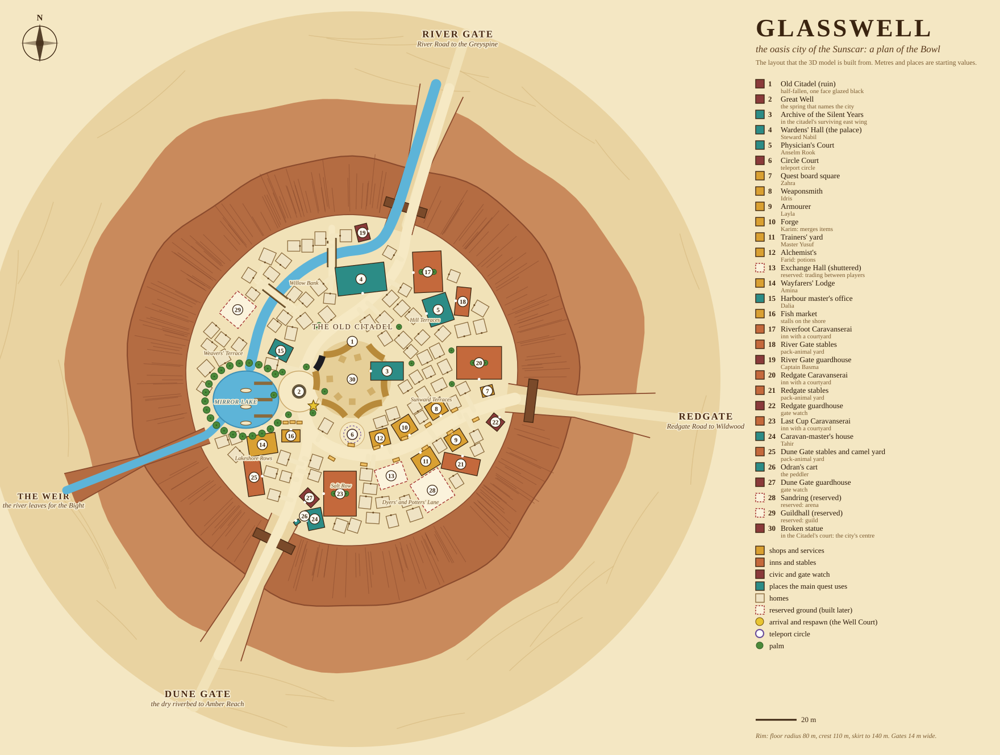

# Glasswell: the desert city (design)

Read this before building or changing the Sunscar's city. **Mostly a design document**: the one thing that exists is the city's 3D **model** (section 10), which can be drawn
from any side with `node tools/city-preview.js` but is not placed in the game: the Sunscar itself is still a placeholder (`docs/WORLD.md` section 8), so the city has no place in the
world, no collision, no people. It covers **only what is inside the city**; the desert around it (zones, monsters, bosses, the glass fields, the caravan grounds outside the gates) is for later.

**Decided by the owner**: the city stands in the Sunscar (the fifth land of the journey: Wildwood, Sakura Vale, Hoarfrost Reach, Greyspine, Sunscar); it is the
continent's main hub and will gain content later; for now only what is inside it; its design is inspired by Rikarisu from *Mushoku Tensei*; **a crater (the Bowl), not walls**;
**80 houses**; **a statue in the middle of the city** (its model is built, what it should do is not: `docs/NOT-BUILT.md`). The name Glasswell,
the cast, the districts, every other number and the lore are *(proposed)*: ask before building on them. Spoilers: the cast and the hints follow `docs/STORY.md`
(mind its section 0, the spoiler rule).

`docs/glasswell-plan.svg` is drawn by `docs/glasswell-plan.py` (run `python3 docs/glasswell-plan.py docs/glasswell-plan.svg --js src/shared/sunscar.js`). Change the data there, not the SVG or
`src/shared/sunscar.js`: the script places the 30 places and the 80 homes (each a real rectangle, on the floor, off the roads and the water, clear of the others) and writes both. The numbers in the key (1-30) are the
building numbers of section 4.

## 1. What it takes from Rikarisu, and what it changes

The page for Rikarisu on the series wiki could not be opened from the build environment (blocked), so the facts below come from search-result summaries of it
([Rikarisu City](https://mushokutensei.fandom.com/wiki/Rikarisu_City)): a crater city with one continuous rim wall and three entrances that are cracks in it, merchants' inns, stables and shops near the entrances, low plain sandstone-and-timber houses in narrow streets, and a half-destroyed castle at the heart. Nothing else about it was checked.
Only its *layout and architecture* are used. **No names, characters or plot of the series appear**: Glasswell is a Wildwood place with its own lore.

| Rikarisu (as described) | Glasswell |
|---|---|
| The city sits in the middle of an enormous crater; the rim is one continuous wall that keeps monsters out | **The Bowl**: a round basin with a rim of red rock all round. Nothing walks in over it; monsters cannot reach the city except through the gates |
| Only three entrances, all cracks in the rim; the walls are too tall to climb unless you can fly | **Three gates**, each a crack through the rim facing one of the three roads (section 2); a fourth crack, the Weir, is a water gate for the river and not a way in |
| Inns, stables and shops for travelling merchants and adventurers stand near the entrance, all joined together | **Gate Rows**: a caravanserai (an inn round a courtyard, for merchants and adventurers alike), a stable yard and a guardhouse inside each gate |
| Low, plain, similar houses of sandstone and wood in narrow streets lined with markets, inns and workshops; as many houses as in the human cities, but not as tall | **The terraces**: 80 low flat-roofed houses in narrow lanes, built from a few shell variants so they look homespun; the **Bazaar Way** is the market street |
| At the very heart stand the ruins of a castle, half destroyed in an old war, thick outer walls round the broken black-and-gold keep: a reminder of faded glory | **The Old Citadel**: a broken ring wall of gold-brown sandstone, fallen towers, one face fused to black glass (the story's glass, section 3) |
| A harsh, rugged, thinly planted frontier | The opposite inside, as `WORLD.md` wants an oasis city: the **Mirror Lake**, the river, palms, terraces. Harsh outside the rim, green inside it |

## 2. The Bowl: shape, gates, water

| What | Value *(proposed, tunable in the script)* |
|---|---|
| Floor (the city) | radius **80 m**, about 20,100 m²: **7.1 village discs** (a village is 30 m); flat, one height |
| Rim | the cliff face rises from the floor's edge; **crest 110 m** from the centre, about 26 m above the floor; the outer skirt slopes down to the plateau at **140 m** |
| Gates | **14 m** wide at the floor, pinching to about 11 m at the crest. Not narrower: the shared heightmap is sampled on a 4 m grid (`CLAUDE.md` section 4, "World size"), so a crack has to be at least 3-4 cells wide to exist for the server |
| The rim cannot be crossed | a rock face steeper than anyone walks, **plus a collision ring at its foot** (what `worldBounds` does for the Vale Wall): a real thing in the land, never an invisible wall (`WORLD.md` section 5). Players and monsters use the gates |

**The three gates are the three roads of `WORLD.md` section 5**, so the city really is where the continent's roads meet:

| Gate | Bearing | Road | The road is open when (`WORLD.md` section 5; the gate itself is always open) |
|---|---|---|---|
| **River Gate** (north-north-east) | `pi - 0.30` | River Road to the Greyspine: the river comes in beside the road | the Greyspine's first boss (29) opens the river road |
| **Redgate** (east) | `pi/2 - 0.12` | Redgate Road to Wildwood, through Redgate Canyon (rock fall until the sand wyrm falls) | the Sunscar's final boss (36) |
| **Dune Gate** (south-south-west) | `-0.45` | the dry riverbed to Amber Reach | the Sunscar's final boss (36) |
| The Weir (west-south-west) | `-1.20` | the river leaves for the Bight through a lock and a grille | never: not a way in |

Bearings use the game's convention: `at(a, r) = (sin a * r, cos a * r)`, so 0 is south, `pi/2` east, `pi` north.

**Water** (`WORLD.md` section 3: the river and the great well make the city): the river enters at the River Gate, bends west round the Wardens' Court and ends in the **Mirror Lake**
(32 x 28 m, west of the Well Court); the lake is fed by **the Great Well**, a deep spring in the Well Court (the city's namesake); the river leaves by the Weir. The city
stands on both banks. In the game the lake is a water basin dug into the floor like the other lakes (`LAKES`, `lakeCut`), with three jetties and moored boats that are client-only views.

**Why a bowl** (`WORLD.md` section 2): the Sunscar is a raised plateau of karst and sandstone; the Great Well's cavern fell in long ago, leaving a round basin over the
aquifer, and the river found it. A natural basin, not a second wonder: the Sunscar's one wonder stays the glass fields (rule 9, `WORLD.md` section 6).

## 3. The districts

| District | Where (metres from the Old Citadel; +x east, +z south) | What is in it |
|---|---|---|
| **The Old Citadel** | the centre, radius 19 | the ruin: ring wall with gaps, fallen towers; **the Archive** in its surviving east wing; the south side faces the Circle Court; **the broken statue** (30) at the exact centre of its court: a robed figure on a stepped plinth, head and one arm gone (the head lies at the plinth's foot), the plinth's inscription chiselled away, as the Quiet chiselled away the murals (`docs/STORY.md`): nobody remembers whose it was. One face of the ring (west-north-west on the plan) is fused to black glass: it looks toward the glass fields, so turn it if the Sunscar's zones put them elsewhere |
| **Well Court** | (-26, 6), plaza radius 9-10 | the Great Well, a brazier (the city's `V.fire`), palms, the arrival and respawn point (-19, 13); the Lake Walk and the harbour start here |
| **The harbour** | the lake's east shore | three jetties, boats, the harbour master's office, the fish market stalls; the Wayfarers' Lodge on the south shore |
| **Bazaar Way** | Redgate to the Well Court, round the Citadel's south side | the market street (about 120 m): quest board square, weaponsmith, armourer, forge, trainers' yard, alchemist, the shuttered Exchange Hall, awnings and stalls both sides |
| **Circle Court** | (0, 27), south of the Citadel | the teleport circle (radius 2.4 m) in a small paved court |
| **Wardens' Court** | (6, -48), north of the Citadel | the Wardens' Hall, the living palace, built of the Citadel's fallen stone: an arcade under a tall tower with a beacon lamp, the tallest building in the city |
| **The Physician's Court** | (42, -34), north-east terrace | Anselm Rook's house and study (story, section 5) |
| **Gate Rows** | inside each gate | River Gate: Riverfoot Caravanserai, stables, guardhouse; Redgate: Redgate Caravanserai, stables, guardhouse; Dune Gate: Last Cup Caravanserai, the caravan-master's house, stables and camel yard, Odran's cart, guardhouse |
| **The terraces** | everywhere else on the floor, between radius 24 and 73 | 80 homes in seven named quarters: Willow Bank and Weavers' Terrace (west of the river), Hill Terraces and Sunward Terraces (north-east and east), Lakeshore Rows, Salt Row, Dyers' and Potters' Lane (south) |

**Walking distances** (the roads' lengths on the plan): from a gate to the Well Court it is about 50 m from the Dune Gate, 90 m from the River Gate and 120 m from Redgate (one to two village-widths).
The three main roads each start at a gate and end at the Well Court, so a newcomer finds the heart by following the road in.

## 4. The buildings (numbers match the plan)

`cat`: **shop** gold, **inn** terracotta, **civic** maroon, **story** teal (places the main quest uses), **reserved** dashed. "Code" is the machinery that already exists for it.

| # | Building | Who / what | Code (existing) |
|---|---|---|---|
| 1 | Old Citadel (ruin) | the heart; collision ring wall with gaps | `V.boxes`, a lore spot (`LORE`) for the glazed face |
| 2 | Great Well | the spring; the Well Court's plaza | `V.circles`, an anchor `well` |
| 3 | Archive of the Silent Years | Mirela; the chronicle shelves (60 pages cut out) | main quest S5; a readable lore spot |
| 4 | Wardens' Hall (the palace) | Steward Nabil | main quest S2 (the palace steward) |
| 5 | Physician's Court | Anselm Rook: the study with identical labelled glass vials and the cold cupboard that hums | main quest S3, S4, S7, S8, S10 |
| 6 | Circle Court | the teleport circle | `V.tele`, `CIRCLES` row |
| 7 | Quest board square | Zahra | `V.board`, role `quests` |
| 8 | Weaponsmith | Idris | role `weaponsmith`: shop and Craft tab (ore) |
| 9 | Armourer | Layla | role `armorer`: shop and Craft tab (logs) |
| 10 | Forge | Karim | role `forge`: merges three identical items |
| 11 | Trainers' yard | Master Yusuf, an open yard with straw dummies | role `trainer`: skills panel, upgrades |
| 12 | Alchemist's | Farid | role `brew`: brewing panel (the desert's herbs, main quest S6) |
| 13 | Exchange Hall (shuttered) | **reserved**: trading between players (main quest S2) | none yet: dressed, doors shut |
| 14 | Wayfarers' Lodge | Amina | role `lodge`: professions, tools, selling resources |
| 15 | Harbour master's office | Dalia | main quest S2 (the harbour master) |
| 16 | Fish market | stalls on the shore | scenery |
| 17 | Riverfoot Caravanserai | an inn round a courtyard, the adventurers' common room | scenery and the schedule's evening spot |
| 18 | River Gate stables | camels and pack beasts | client-only animals |
| 19 | River Gate guardhouse | Captain Basma, who counts who comes in | role `null`, lines |
| 20 | Redgate Caravanserai | inn | as 17 |
| 21 | Redgate stables | pack-animal yard | as 18 |
| 22 | Redgate guardhouse | gate watch | as 19 |
| 23 | Last Cup Caravanserai | inn | as 17 |
| 24 | Caravan-master's house | Tahir, who knows every road | the main quest's hub cast (section 7.3); role `null` |
| 25 | Dune Gate stables and camel yard | the biggest yard: the Amber Reach caravans stop here | as 18 |
| 26 | Odran's cart | the peddler | role `peddler`, `odranHere(5)`, `V.cart` |
| 27 | Dune Gate guardhouse | gate watch | as 19 |
| 28 | Sandring (reserved) | **reserved**: an arena later (`WORLD.md`) | none yet: a walled sand yard with the gate shut |
| 29 | Guildhall (reserved) | **reserved**: a guild later (`WORLD.md`) | none yet: a hall with its shutters closed |
| 30 | Broken statue | the city's centre, in the Citadel's court; its erased inscription is a hint (the Silent Years) | model only: no lore spot, nothing to read or do (`docs/NOT-BUILT.md`) |

Plus 80 homes (`V.houses`: the same fields as a village's, so random villagers can live in them: `home:'house:i'`). Their sizes are 4.8-6.8 m, walls 3-4 m, in four kinds (plain, a rooftop room, a dome, a porch under a striped cloth). The reserved plots are dressed, not empty: the Wardens'
notice on each door says it opens "when the roads are safe", so the hub can grow later without re-laying the city.

## 5. People

Named people (all `vil:5, late:true`, so no random villager changes look, `CLAUDE.md` section 8). **Rook, Mirela, Tahir and Odran come from the plan** (`docs/MAIN-QUEST.md` section 7.3,
`docs/STORY.md`); the palace steward, the harbour master, an alchemist and a trainer are roles in it too (S2, S6), but their names here are proposals, like everyone else's.

| Id | Name | Role | Where |
|---|---|---|---|
| `rook` | Physician Anselm Rook | the court physician; a watcher: helpful, a little odd, never a villain on screen before the reveal | 5 |
| `mirela` | Archivist Mirela | shows the chronicle: 60 pages cut out cleanly | 3 |
| `tahir` | Caravan-master Tahir | roads, news; the hub's guide | 24 |
| `odran5` | Odran | the peddler, always one step ahead | 26 |
| `nabil` | Steward Nabil | speaks for the Warden of the Well, who rules the city and is never seen | 4 |
| `dalia` | Harbour-master Dalia | the lake, the boats, the weir | 15 |
| `zahra` | Zahra | quest board | 7 |
| `idris` / `layla` / `karim` | Idris / Layla / Karim | weaponsmith / armourer / forge | 8, 9, 10 |
| `yusuf` | Master Yusuf | skill trainer | 11 |
| `farid` | Alchemist Farid | brews | 12 |
| `amina` | Amina | keeper of the Wayfarers' Lodge | 14 |
| `basma` | Captain Basma | the guard; keeps the River Gate | 19 |
| `hamid` | Old Hamid, the well-singer | the storyteller every village has: sits at the Great Well and sings the old songs | 2 |

Townsfolk: start with about **20** wandering villagers (`behavior:'wander'`, `schedule:'day'`) plus the 15 named; the guards stand at the gates at night too. Each is a full
character rig (`buildCharacter`), so the number of people is the cost to watch: measure with `renderer.info` before adding more.

**Hints, within the spoiler rule** (two readings each, `STORY.md` section 6): Rook's study (identical labelled vials, the humming cold cupboard); the Archive's cut pages and
Mirela's reluctance ("those were quiet times"); the Citadel's glazed face, which the city explains as "where the sun wept here too"; the Wardens' notices; coins that are all alike
in Tahir's counting house. Nobody says "technology" or names an outside power before the reveal.

## 6. Services (what the city does, and the machinery it uses)

| Need | Machinery that exists | Note |
|---|---|---|
| Shops, forge, trainer, quest board, Lodge, brewing, peddler | the roles in `VILLAGERS` (section 4) | every one of them also asks for `inVillage(p)` on the server: that needs the city's radius (section 8) |
| Respawn | `respawnVil` (`server/players.js`) | the Well Court once you have walked into the city (`gear.sun` 2, section 8) |
| Teleport circle | `CIRCLES` (`shared/hoarfrost.js`): one more row, `V:VIL5`; the travel window lists it | wakes when you have walked into the city; it is where the main quest sends you home (S8) |
| Safe ground | `nearestFighter` skips players in a village; monsters stop at the boundary | the **rim** keeps monsters out physically, so the safe zone is the whole floor, not a disc |
| Selling resources, tools | the Lodge (`sellResP`) | the Sunscar needs its own grade of ore, logs and herbs first (`HERB_LANDS`, `ORE_GRADES`, `LOG_GRADES`, `TOOL_MAT`: main quest S6) |
| Gear for levels 28-36 | the shops sell by `tierFor(level)` | **gear stops at tier 5 from level 25** (`CLAUDE.md` section 9): a level-30 city would sell the same top tier as the Reach until a tier 6 exists (`docs/MAIN-QUEST.md` section 7.2). Not a blocker for the layout, a gap for the shops |

## 7. The hub: what is held for later

The city is meant to grow, so ground is **reserved and dressed** rather than left empty (the three dashed plots on the plan):

| Plot | For | From |
|---|---|---|
| 13 Exchange Hall | trading between players, "a bazaar" | `docs/MAIN-QUEST.md` S2, section 7.7 item 6 |
| 28 Sandring | an arena | `docs/WORLD.md`, Sunscar entry |
| 29 Guildhall | a guild | `docs/WORLD.md`, Sunscar entry |

Three gates and one circle are also the hub's structure for travel: more roads or circle destinations later are rows in `ROADS` and `CIRCLES`, not changes to the city.
Anything else added to the city should take one of these plots, or a new one on the terraces, and be added to the script and this file.

## 8. What building it takes (in order)

The model (section 10) is item 4 and the data of item 3; everything else is not started. What was found in the code, so the work is not a surprise:

1. **A village is 30 m wide in about 47 lines of code.** `VR` (30) stands for "this village's radius" in `shared/village-helpers.js`, `shared/professions.js` (`nearLodge`), `server/monsters.js` (camps keep
   off, monsters turn back), `server/players.js` (`inVillage`), `server/main-quest.js`, `shared/main-quest.js`, `game/ui/map.js`, `game/world/time-of-day.js`, `game/audio/music.js`, `ambience.js`,
   `game/world/terrain-color.js`, `generation-chunks.js`, `game/village/buildings-*.js` and a few more (18 files). `shared/terrain-height.js` and `reachHanamiP` already use the village's own `V.r`.
   The city needs those to read `V.r` of the village at hand (80 here), with 30 kept as the default. This is the biggest change, and mechanical.
2. **The world rectangle grows west** (`WX0`, `docs/MAIN-QUEST.md` section 7.7 item 2) and the Sunscar's placeholder in `game/world/far-lands.js` is replaced. The Bowl is `bowlCarve(x,z,h)` called by
   `rawHeight` like `passCarve` (floor flat, rim face, skirt, the four cracks), plus the collision ring in `worldBounds` and `setPos`.
3. **Built: `shared/sunscar.js` (the layout as plain data) and `shared/sunscar-shape.js` (`gwRimH`, the Bowl as a height function, which `rawHeight` can call). Still to do**: the city layout as a `layoutVillage`-shaped object (`x,z,h,r,houses,stalls,lamps,anchors,boxes,paths,circles,ent,spawn,tele,board,fire,sign`, plus `gates`, `districts`,
   `docks`) built from the script's data; `VIL5` added to `VILS` and `vilAt` (a region test for the Sunscar); a `gear.sun` (0 closed, 1 open, 2 walked into the city) beside `gear.east` and `gear.north`,
   sanitized like them; a `CIRCLES` row; `respawnVil`; `reachGlasswellP`.
4. **Built (the model, section 10), still to do: placing it** (`buildGlasswell({x,z,h})` from `generation-setup.js` once the Sunscar has ground to put it on), the collision boxes (`V.boxes`: 106 footprints are in the data), the lights.
   Measured (`tools/city-preview.js`): the city is about **93,000 triangles** (buildings 84,000, water 5,000, palms 4,000) in a few merged meshes, and the model's own rim and floor add 36,000 that the heightmap makes unnecessary.
5. **People and places**: the `VILLAGERS` rows of section 5 (`vil:5`), labels, `odran5`, the lore spots (the glazed face, the Archive shelves, the vials), `V.cart`.
6. **Life**: a music theme `glasswell` and ambience (water, voices, camels; no rain); the Sunscar has no rain, and the server still has one weather (`docs/NOT-BUILT.md` section 3): the
   client turns rain into blowing dust there, as it turns it into snow in the Reach, and a **sandstorm** is a client haze that the Bowl keeps out of the lanes (a reason the city is a shelter);
   the map (`LANDS.sunscar` and `placeName` in `game/ui/map.js`); one point light at the Well Court's brazier (`fireLight`), lamps elsewhere as emissive meshes, because lights are expensive.
7. **Tests**: `tools/glasswell-smoke.js` exists (layout invariants, the rim's height function, and that the model builds in a real browser). Still to do: the circle's warp and the respawn, a Lodge and a shop working anywhere on the
   floor but not outside the rim, anchors for the NPCs.

Suggested stages, each testable alone: **A** shape and layout (terrain, rim, gates, the `V.r` change, walking in), **B** dressing (meshes: **done as a model**), **C** people and services, **D** life (music, weather, map), **E** tests (the layout part is done).

## 9. Open questions for the owner

(Decided: a crater instead of walls, 80 houses, a statue in the middle.)

- **Size.** 80 m floor radius (7 villages) makes it feel like a city, but the Bowl with its skirt is 280 m across, about half the width of a land (`WORLD.md` section 6, rule 2: 450-650 m). 60 m would
  leave more desert; 100 m more city. One number in the script (`R_FLOOR`).
- **The glazed face** of the Citadel: which way the glass fields lie, and whether the city should mention the glass fields at all before the main quest sends the player there (S7).
- **Gear tier 6** (levels 30-34) before the shops open, or open the city with tier 5 and fix it later.
- **Name**: Glasswell is the working name from `WORLD.md`; the Warden of the Well and the cast names are proposals.

## 10. The model (built)

A 3D model of the whole city, made from the layout data, drawn like the game's villages (vertex-coloured geometry merged into a few meshes, `villageMat`). It is **not in the game's world**: `buildGlasswell` is called by
nothing but the preview tool.

| File | What it makes |
|---|---|
| `src/shared/sunscar.js` | the layout as data (generated by `docs/glasswell-plan.py`; never edit by hand) |
| `src/shared/sunscar-shape.js` | `gwRimH(x,z)`, the Bowl as a height function: the rim, the three gate cracks and the Weir's gorge; pure, so the heightmap and the server's collision can use it |
| `src/game/village/sun-rim.js` | the rim and the floor (own mesh), the Mirror Lake and the river with their curbs, the two footbridges, the three gates (arched masonry wall, crenellated towers with pyramid roofs, open doors, braziers), the Weir's lock, `gwGround` (the floor's colours: sand, roads, lanes, paving) |
| `src/game/village/sun-ruin.js` | the Old Citadel (ashlar ring wall with breaches, six towers, one black-glass face with drips), **the broken statue**, the Great Well (a pavilion of four pillars, windlass and bucket, troughs, benches, a brazier), the Circle Court's stones |
| `src/game/village/sun-houses.js` | the 80 homes (four kinds), the three caravanserais (court, rooms, fountain, awning), the stables and the camel yard's fence, the guardhouses, the painted signs |
| `src/game/village/sun-halls.js` | the Wardens' Hall (an arcade under a tall tower with a lantern room, a beacon lamp, a pyramid cap and a pennant, two corner towers, banners), the Archive, the Physician's Court, and the three reserved plots (doors chained, windows boarded, a sealed notice) |
| `src/game/village/sun-shops.js` | the weaponsmith, armourer, forge (open hearth with flames), trainers' yard, alchemist (a dome with a glass lantern), quest board, Lodge yard, harbour master (a lamp tower), fish market; the market stalls, shade cloths across the street, iron lamps |
| `src/game/village/sun-props.js` | date palms (round the lake, the Well Court, the courtyards and in the gaps), the jetties and the moored dhows |
| `src/game/village/buildings-sun.js` | `buildGlasswell({x,z,h})`: assembles the parts into a THREE.Group |

**See it**: `node tools/city-preview.js [outDir] --views overview,top,street,citadel,statue,well,lake,hall,archive,physician,reserved,inn,homes,gate,weir` (or `--cam x,y,z,tx,ty,tz` for your own;
coordinates are the city's frame) draws PNGs in real WebGL (headless Chromium), lit like the game. It prints the triangle and mesh counts and how long the model took to build (about 0.5 s of JavaScript on this machine,
to be added to the world's generation when the city is placed). `node tools/glasswell-smoke.js` checks the layout and that the model builds.

**Not in the model** (each is in `docs/NOT-BUILT.md`): placement in the world, collision, lights (the flames are cones that `buildings.js` animates; there is no point light yet), the teleport circle's glow
(`buildCircle` in `buildings-vale.js` adds it when the city is placed), the villagers, the camels and other animals, readable lore spots (the statue's plinth, the Archive's shelves, the glazed face), the doors (all
closed boxes, like the villages'), interiors, and a lit night look (the windows use the villages' `windowMat`, which the day-night code lights).
