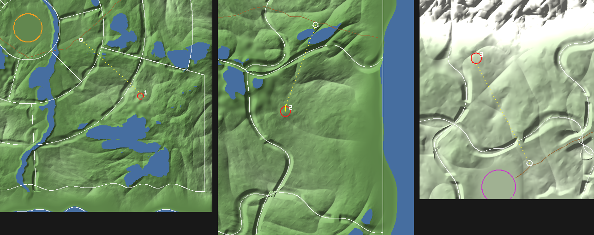

# The three dungeons, their entrances, their bosses and the hourly offer

**Status: designs plus data, not playable.** The machinery they run on is in `docs/DUNGEONS.md` (tiles, missions, parties, the server plan). What exists in code is the data of the three
dungeons (`DG_THEMES`), of their three entrances (`DG_ENTRANCES`, section 6), of their three bosses (`DG_BOSSES`), the hourly offer (`dgOffer`) and the entry rule (`dgUnlocked`, `dgLevel`, `dgGateOpen`) in `src/shared/dungeons.js`, and the rewards (section 7: `DG_REWARDS`, the level-30 gear, the ring, enhancing, the stone) in `src/shared/dungeon-rewards.js`, checked by
`tools/dungeons-smoke.js` (97 checks); `tools/entrance-map.js` draws the map of section 6; the doors' client dressing (section 6) is built and tested by `tools/entrances-client-smoke.js`. The tile art is drawn (section 3: one file per dungeon in `src/shared/dungeons/themes/`, entered through `defineDungeonTheme`) and the three bosses are built (section 4: `src/server/dungeons/boss-kits.js`, tested by `tools/dungeon-boss-smoke.js`).
*(proposed)* = my suggestion. An earlier version of this file had nine dungeons and bosses drawn at random; those are gone, and the six dungeons I did not pick are kept in section 5.

## 1. What the owner decided

- **One dungeon for each built land** (Wildwood, the Sakura Vale, the Hoarfrost Reach): three in all.
- **The mission type rotates every hour.** Each dungeon offers **two types at a time, picked at random**; the players choose one of the two (section 2).
- **Three new bosses, one for each dungeon** (section 4). No more random draw of the old six.
- **The base is level 30** (`DG_LV`). The difficulty is the land's own +N setting (`gear.zt[land].on`, picked under the map in a village), each land having a base: **Wildwood's dungeon is locked
  at +0 and level 30 at +1**; the Vale's and the Reach's are level 30 at +0. Above the base the zone-tier rule applies (the owner confirmed it), **+10 levels a tier** (`ZTIER_STEP`), now up to tier V: Wildwood +1 ... +5 = 30 / 40 / 50 / 60 / 70,
  the others +0 ... +5 = 30 / 40 / 50 / 60 / 70 / 80. You may enter from **level 25 at every difficulty** (`DG_ENTRY_LV`, the owner's rule; it used to be the dungeon's level less 5, which asked for level 55 at the +III Vale and Reach dungeons, more than anyone can have). A party plays at its **leader's tier** for that land; a member needs that tier
  **unlocked**, not played, and the level for it. The Vale's dungeon also needs Hanami walked into (`gear.east` 2), the Reach's Rimehold (`gear.north` 2). Tested.
- **Rewards** (section 7): a clear pays one random level-30 item, weapons / armour / rings by dungeon. Kills still pay what the world pays at the dungeon's level (`rewardKill`) and the boss the boss table; from level 30 a normal monster's equipment roll becomes the tempering stone.

## 2. The hourly offer

- **Two types of the seven** (Purge, Defense, Survival, Sabotage, Siege, Hunt, Escort) are on offer in each dungeon at any time; the leader picks one on the Delve board when starting the run.
- **It changes at the top of every hour, UTC, for everyone at once.** The board shows the two types and a countdown (`dgOfferLeft`). A run keeps its type when the hour turns; if the hour turns between opening
  the board and pressing Start, the server refuses ("the offer changed") and the board refreshes.
- **Random but fair** (`dgOffer(dungeon, time)`, the same on the server and every client): the 21 pairs of seven types are dealt in a seeded shuffle, one pair an hour, **every pair once in every 21-hour
  cycle** (so no type is starved), and **never the same pair two hours running**, also across cycles. Each dungeon has its own order. Tested over 3,000 hours. The first six hours from 12:00 UTC on 3 October 2026:

| | Hollow Roots | Jade Spring Grottoes | Bonefrost Barrow |
|---|---|---|---|
| 12:00 | Purge + Defense | Survival + Siege | Survival + Hunt |
| 13:00 | Purge + Survival | Defense + Escort | Defense + Siege |
| 14:00 | Defense + Hunt | Sabotage + Escort | Defense + Survival |
| 15:00 | Survival + Escort | Purge + Escort | Purge + Escort |
| 16:00 | Defense + Survival | Survival + Sabotage | Purge + Sabotage |
| 17:00 | Defense + Sabotage | Siege + Hunt | Defense + Siege |

- **No gating by clears any more** (an earlier plan: Purge first, then Defense...): with a random offer a hiker might never be offered the type that unlocks the next. Every type is open from the start.
- The pool is a parameter: until all seven missions are built the first release offers only the built ones (with two types it is always that pair). The time is the server's clock; in Solo the page's.

## 3. The three dungeons

| Dungeon | Land | Lies under | Elements | Walkers | Guardians | Boss |
|---|---|---|---|---|---|---|
| **The Hollow Roots** | Wildwood | Ancient Grove | earth, dark (+ air, water, light, fire) | Treant, Deathcap, Shroomling, Bog Slime, Dire Boar | Ancient Treant, Rotwood Treant | **Amanita, the Sporemother** |
| **Jade Spring Grottoes** | Sakura Vale | Jade Falls | water, air, dark, earth | Kappa, Jade Slime, Blue Oni, Karasu Tengu, Jorogumo, Mountain Boar | Bamboo Treant | **Gawataro, the Jade Elder** |
| **Bonefrost Barrow** | Hoarfrost Reach | Bonefrost Barrow | dark | Draugr, Rime Revenant, Barrow Wight, Ice Wraith, Frost Reaver | none | **Haugbui, the Barrow Lord** |

Why these three: the Hollow Roots is the Wildwood lore (`WORLD.md`: the Heartwood, whose roots reach the Rootdeep); the Jade Springs are the onsen `WORLD.md` suggests for the Vale and give it a water
dungeon its two bosses (Akaoni, Kyuubi) do not cover; the Barrow is the Reach's dark element and the one place the Reach's undead live. Each is a different feel (living and warm, wet and green, dead and lightless).

**Walkers and guardians.** The doors are 4 m wide and a walker steers well only up to a radius of 0.9 m (`docs/DUNGEONS.md` section 3), so each dungeon splits its monsters: **walkers** (radius <= 0.9 m: they
make the waves and packs and walk the whole dungeon) and **guardians** (the big kinds: they stand in a hall, a site or a room and do not leave it; Defense's waves never include them). At least 4 kinds of walker. Tested.
**Hazards use what the bosses already do** (`server/boss-fx.js` primitives, never a new engine feature); a tile marker `H` for a hazard spot is the *proposed* hook, not in the code. **Story**: the spoiler rule
of `STORY.md` holds; per its section 6 rule 5 Wildwood's monsters look the least touched, the Vale's may carry a rare grey vein, the Reach's more; the Concord's emblem is used nowhere.
**Where you enter**: a door in the world, one for each dungeon, in the zone it lies under (`at`): section 6. (An earlier plan had a Dungeon Gate in every village; the doors replace it.)

**The Hollow Roots.** A hollow under the Ancient Grove where the roots of the Heartwood go down. Warm dark, brown and green, sap and fungus for light, dripping. Tiles to draw (roles of `docs/DUNGEONS.md`
section 3: hall = the round boss circle, rooms 24 m, pass 8 m, site 20 m, cache and entrance 16 m): hall **Root Cathedral** (the circle ringed by trunks of root; the pillars are root pillars), rooms **Sap Cellar**
and **Fungus Alcove**, pass **Crawlway**, site **Heartwood Knot**, cache **Seed Nook**, entrance **Burrow Mouth**. Hazard: **root spikes** (the Rootwarden's `root` telegraph) in the rooted floors. Guardians: the Ancient
Treant in an antechamber site, the Rotwood in a Fungus Alcove.

**Jade Spring Grottoes.** Warm caves behind Jade Falls where the hot springs rise: jade pools, rising steam, bamboo roots through the ceiling. Green and white, soft water noise. Tiles: hall **Great Basin** (a round
jade pool with a stone rim), rooms **Bath Hall** and **Bamboo Cellar**, pass **Steam Corridor**, site **Spring Head**, cache **Offering Basin**, entrance **Waterfall Door**. Hazard: **steam vents** (the `geyser` telegraph).
Guardian: the Bamboo Treant in the Bamboo Cellar.

**Bonefrost Barrow.** The burial mound at Bonefrost Barrow, the long grave of a vanished clan: stone passages, cairns, bone-white rime. Grey-blue, lightless, a low wind in the passages. Tiles: hall **Great Burial Chamber**,
rooms **Cairn Room** and **Urn Hall**, pass **Passage Grave**, site **Rune Pillar Cell**, cache **Grave Goods**, entrance **Barrow Door**. Hazard: **gloom** (client-only: your light shrinks in unlit rooms; the braziers
are the way) and ice `prison` marks. No guardians: the barrow is walkers only.

**The tile kits: drawn** (`src/shared/dungeons/themes/<id>.js`: one `defineDungeonTheme({...})` call each, no top-level names, one line in `src/manifest.json`; the fields are in `shared/dungeons.js`). A bad theme is left out,
warned about and listed in `DG_BAD` (the game still boots; `tools/dungeons-smoke.js` fails naming the theme and field). Each kit is the seven tiles named above plus a second pass (Root Bend, Pooled Bend, Grave Bend), each drawn once with its
rim closed and opened for every door shape it comes in (`shapes`, `dgCarve`): 32 tiles a dungeon, and all seven missions generate on 300 seeds with each kit. The hall is the same circle in all three: its four pillars (4 m squares at
+-10 m, `DG_HALL_PILLARS`) and four mouths (+-13 m, `DG_HALL_MOUTHS`) are fixed because the bosses use them. A theme's **legend** (`{char:{solid, prop, hazard?, light?, post?}}`) adds characters: solid ones block like `#`
(collision, sight, the flow field), and `dgBake` lists every legend cell in `B.props` as `{k, x, z}` (local metres; `hz` for a hazard spot). Hazards are set off at run time by `server/dungeons/hazards.js` (built: the telegraphs, damage, root / slow and timings are in its agent map and `docs/DUNGEONS.md` section 4).

| Dungeon | Solid | Floor | Hazard spots (`hz`) |
|---|---|---|---|
| Hollow Roots | `R` root wall, `I` root pillar, `T` root trunk, `m` mushrooms, `k` heartwood knot | `f` glowing fungus (light), `s` sap pool (light), `n` seed pods, `G` guardian post | `^` root spikes, `spikes`: the Rootwarden's `root` telegraph |
| Jade Springs | `r` stone rim, `J` jade column, `b` bamboo, `l` stone lantern (light), `u` offering bowl | `w` spring water (light), `~` steam, `G` guardian post | `v` steam vent, `steam`: the `geyser` telegraph |
| Bonefrost Barrow | `N` burial niche, `X` rune pillar, `K` cairn, `U` urn, `Y` brazier (light) | `g` grave slab, `b` bones | `x` rime, `prison`: ice-prison marks; gloom (client) everywhere away from a `Y` |

Guardian posts: the Rotwood in the Fungus Alcove, the Ancient Treant in the Heartwood Knot, the Bamboo Treant in the Bamboo Cellar. Gawataro's five vents and Haugbui's lamps are the bosses' own (section 4), not drawn.

**What every mission calls its objectives** (the mechanics are those of `docs/DUNGEONS.md` section 4):

| Dungeon | Defense: the stone | Survival: the light | Sabotage: three... | Siege: three altars | Hunt: the quarry | Escort: the captive |
|---|---|---|---|---|---|---|
| Hollow Roots | the Heartwood Knot | a sap-lamp | heartroots | seed shrines | a runaway Shroomling | a hunter in a root cocoon |
| Jade Springs | the jade basin | a stone lantern | spring gates | offering stones | a Karasu Tengu in flight | the bath-house keeper |
| Bonefrost Barrow | the warding rune stone | a grave lamp | burial cairns | rune pillars | a Barrow Wight slipping between graves | a snared grave-warden |

## 4. The three bosses

All three are built from what the six existing bosses use (a model family and its `pal` flags, the telegraph / zone / pfx / summon primitives of `server/boss-fx.js`, a kit with `start` / `tick` / `phase`), appear
in the dungeon's **round hall** (r = 20 m, the size of every boss arena, so the kits' `A.x`, `A.z`, `A.r` work as they are) when the mission's objectives are done, rise from the hall's middle (the `B` spot),
engage when a player steps into the circle, and use the shared melee, phases at 60% and 30% (the last one enraged), and reset as the world bosses do. **Level 30 at the dungeon's base** (+10 a tier above it);
**health 70 hits of a same-level player: 23,400 at level 30, 30,800 at 40, 43,500 at 50, 67,800 at 60**, multiplied by the party (x2.0 / 2.8 / 3.6: 84,300 for four at level 30); **a hit is 718 at level 30**
(889 / 1,180 / 1,740), and a move is worth a number of hits (x). **Above level 60 monsters creep tougher** (`LATE_CREEP_*` and `BOSS_CREEP_*` in `defAt`, `docs/areas/tiers.md`): every monster's health grows x base^(level - 60) (a boss 13/12, a normal monster 1.065) and a boss also gets +1.25% health and +5% damage a level, so at level 70 (+V in Wildwood, +IV in the Vale and the Reach) a boss has 295,500 health and a 4,344 hit, and at level 80 (+V in the Vale and the Reach) 1,400,000 health and a 10,763 hit; the levels up to 60 are as above. The hall has four pillars about 13 m from the middle; in a Defense or Survival run the stone or the lantern also stands in it, and **no boss move
targets it** (only players are hurt; the stone's own breakers do not appear once the boss is out). Each boss has one **signature mechanic** that no other boss has, and a list of **new primitives** it needs, each small
(M3 of `docs/DUNGEONS.md`); everything else is the existing primitives. `aux` is what the boss bar's number shows. Each is in `DG_BOSSES` with its moves named by primitive; the test checks the names.

**Status: built** (`tools/dungeon-boss-smoke.js`, 37 checks: each fought through its phases in a real hall, every move of its design seen, moves no other of the nine bosses has, the signatures, nothing left behind, the models).
Defs `DG_BOSS_DEFS` (`shared/dungeons/bosses.js`: rows shaped like `BOSS_DEFS`, keyed `amanita` / `gawataro` / `haugbui` = each theme's `boss`); a run makes one with `makeBossS(DG_BOSS_DEFS[theme.boss], dgHallArena(bake, ox, oz))`
(the arena is the hall's circle plus `solid(x,z)`, the hall's walls and pillars; without it nothing gives cover and the charge runs to the arena's edge). Kits `BOSS_KITS.spore / dish / barrow` (`server/dungeons/boss-kits.js`), new primitives
`server/dungeons/boss-fx.js` (`DG_BOSS_NEEDS` maps each need to its code). Client: telegraph looks `spore` `puff` `pulse` `vent` `wail` `snuff` (`game/combat/boss.js`; the server resolves them as circles), the zone `spore` (`boss-fx.js`), Haugbui and
the Grave Wisp in the ghost builder (`monster-spirits.js`), the bar's number, lamp glow, the relight cast bar and the gloom (`game/combat/boss-dungeon.js`). Events: `dglamp [lamp id, 1 lit / 0 dark]`, `dgch [pid, s, label]` / `dgchx [pid]`.
**Different from the text below**: the telegraph kinds are named for their look (puffballs `puff` and vents `vent` rather than `geyser`, the pulse `pulse`, the wail `wail`, the snuffing ring `snuff`); Cold Breath also spares whoever has a pillar
between them and him (4.4's "cover from the breath"); the lamps are the boss's own props with a channel of the kit's own (`kit.use(B, m, p)`: the run's use message calls it), not run objectives; the lamps stand at the pillars' inner corners,
9.6 m out, so the wail's 8 m shelter leaves the middle open; the vents' 12 m ring misses the pillars at +-10 m; Gawataro shows no "Charging!" (mode 1 lifts a boss off the ground on the client).

| Hook (one line each, marked `// dungeons:`) | File |
|---|---|
| a boss kit's hit hook (`kit.hit`, Gawataro's dish) | `server/combat.js` `damageMonsterS` |
| a dungeon boss's row and arena for the boss bar and music (`bossInfo`, `arenaOf`), its number on the bar (`dgBossBarText`) | `game/combat/boss.js` (3 lines) |
| the blackout's gloom (`dgGloomTint`) | `game/world/time-of-day.js` `updateEnv` |

### 4.1 Amanita, the Sporemother (the Hollow Roots)

*The hollow's heart, a fungus the size of a house, fed by the Heartwood's roots. The old woodcutters said a mushroom the size of a hut grows where the roots go deepest, and that you must not eat what grows near it.*

| | |
|---|---|
| Level, element | 30 (+10 a tier), **earth** (air skills hit her x1.5) |
| Look | the **mushroom model** at scale 5.5: radius 2.2 m, 6.1 m tall, the biggest boss; a deep rose cap with pale glowing-green spots, cream stem, dusky gills (`pal` cap 0x7a2a48, spot 0xd8f08a, stem 0xcfc3a8, gill 0x6a4a58, feet 0x8a7a68). A first build is palette only (no new model code); a ring of small caps on her cap's rim would be a later trimming |
| Speed, hit rate | speed 1.7, the slowest boss (the Rootwarden 1.9), a swing every 2.6 s; music `boss15` (the Rootwarden's, as Carapax's placeholder) |
| Her adds | **Sporelings** (the mushroom model, scale 0.7, 60% health), and **Puffballs**, props: a pale swollen mushroom, scale 0.9, one swing of health, no XP |

| Phase | Move | What it is | x hit | How you beat it |
|---|---|---|---|---|
| 1 | **Cap Slam** | when someone is within 6 m: a 1.4 s cast, a `slam` circle of 6.7 m | 1.4 | stay out of the ring, hit her after |
| 1 | **Spore Cloud** | every 10 s three clouds, the first two on players: a ring warns 1.4 s, then a cloud of 4.5 m stays 10 s, hurting every 0.6 s and **slowing** | 0.18 a tick | walk out of it; clouds also close off ground |
| 1 | **Puffballs** *(signature)* | every 15 s four puffballs pop up at random points at least 6 m from her. Each swells under a 6 s `geyser` warning (5.5 m) and **bursts** (and leaves a cloud) unless it is **killed first, which cancels the burst**. `aux` = how many are about to burst | 1.7 | one hunter pops them while the others fight her; a solo hiker pops two or three and dodges the rest |
| 2 (60%) | **Sporelings** | every 20 s four sporelings rise at the hall's four monster mouths and hunt | | thin them with area skills |
| 2 | **Spore Pulse** | every 14 s, a 2.2 s warning, then the whole hall: a hit and a 3 s slow. **A pillar between you and her shelters you** (line of sight in the run's grid); the open world version would have no shelter | 1.2 | hide behind a pillar when the warning shows |
| 3 (30%, enraged) | **Sporefall** | every 12 s, 14 `icefall` circles of 3 m fall over 6 s across the hall, the first three under players, each also slowing; her slam winds up faster, puffballs come six at a time and clouds five | 0.8 each | keep moving, never stop to cast |

New primitives: a **zone kind `spore`** (the ember pool's code with a slow on every tick; a tint on the client), **cancelling one telegraph** (`cancelTeleS`: remove it with an unfired `tend`), and a **telegraph exemption** (`e.safe(p)`, here the pillar's line of sight; also Haugbui's lamps).
Different from the six: a hazard you can *cancel* by killing it, and a hall-wide hit the architecture shelters you from.

### 4.2 Gawataro, the Jade Elder (Jade Spring Grottoes)

*The oldest kappa of the springs, who keeps the Great Basin. A kappa carries the water that gives it strength in the dish (sara) on its head, loves sumo, and is bound by courtesy: bow to one and it bows back and spills its dish.*
(The folklore is used as it is told, `WORLD.md` rule 8.)

| | |
|---|---|
| Level, element | 30 (+10 a tier), **water** (earth skills hit him x1.5) |
| Look | the **goblin family's kappa form** at scale 2.6: radius 1.2 m, 4.7 m tall; jade-green skin, a broad dark-green shell, yellow eyes, a kanabo (`pal` form `kappa`, skin 0x4f9a86, eyes 0xf2e04a, shell 0x3a6a4a, weapon `kanabo`...). No new model code: the form, the shell and the weapon exist |
| Speed, hit rate | speed 2.4, a swing every 2.3 s; music `boss20` (Akaoni's) |
| Adds | **Kappa Whelps** (the kappa form at scale 0.6, 60% health) |

| Phase | Move | What it is | x hit | How you beat it |
|---|---|---|---|---|
| 1 | **Kanabo Sweep** | when someone is in melee: a 1.2 s cast, a 120 degree `cone` of 7 m that **shoves** 14 m/s | 1.2 | step out of the arc; the cast is your chance to get behind him |
| 1 | **Vent Dance** | every 12 s the Basin's five steam vents (a ring of 12 m, every 72 degrees) erupt **clockwise one after another**, 0.7 s apart, each a 0.9 s `geyser` of 3.2 m, starting at a random vent | 1.0 each | learn the order and walk the ring ahead of it |
| 1 | **Whirlpool Shepherd** | every 16 s two whirlpools (5 m, 8 s) open under random players and pull in | | run out early |
| 1 | **The Dish** *(signature)* | his dish holds the spring: `aux` is its water, 100% to 0. **Hits from behind** (the 140 degrees at his back, ranged shots too) **spill it**, 2.5% a hit; he always turns to the nearest player, so someone must draw him while another gets behind, or you use his casts. At 0 he **stands dried and stunned 5 s (x1.5 damage)** and the dish refills | | work in pairs; solo, strike during his casts |
| 2 (60%) | **Sumo Charge** | every 18 s he marks the farthest player, a 1.4 s `line` warning (3 m either side), then charges the whole line in 0.9 s, throwing players aside. **He stops at the first wall in his path, a pillar or the hall's wall, and is stunned 3 s (x1.5)**: stand so a pillar is between you | 2.0 | line a pillar up behind you |
| 2 | **Kappa Whelps** | every 22 s three whelps run in from the monster mouths | | |
| 3 (30%, enraged) | **Spring Surge** | every 15 s two `wall` waves roll across from opposite sides, their gaps in different places; the dish now spills faster (his anger leaves him open) | 1.4 | find the gaps; keep hitting his back |

New primitives: a **hit hook** in a boss kit (`kit.hit(B,m,p,d)`, called from `damageMonsterS`: the angle of the attacker to his back), and a **glide that stops at the first wall** (`moveBossS` checking the run's grid, `dgSolid`; in the open it would run to the arena's edge). Different from the six:
a vulnerability you *position* for rather than wait out, and a charge you aim at the scenery.

### 4.3 Haugbui, the Barrow Lord (Bonefrost Barrow)

*Old Norse haugbui, the mound-dweller: the dead who keep their own grave. The clan lit lamps at the pillars of the chamber to keep the dead quiet; the hunters say the lamps are the only thing it fears.*

| | |
|---|---|
| Level, element | 30 (+10 a tier), **dark** (light skills hit him x1.5) |
| Look | the **ghost model** (the wisp's) at scale 3.4: it floats, radius 1.5 m, 5.4 m tall; a huge Barrow Wight, a cold slate-blue shroud, a white-blue core, a black hollow face (`pal` body 0x7a8ca0, core 0xe8f4ff, eye 0x0a0e14, hair 0x141a24, ghost 1). **Small model work**: the ghost builder picks its look by monster id, so `haugbui` is added to the Barrow Wight's branch (`monster-spirits.js`) |
| Speed, hit rate | speed 2.6, a swing every 2.0 s; music `boss26` (the Rimeking's) |
| Adds, props | **Grave Wisps** (the ghost model at scale 0.6, 60% health); **Barrow Lamps**, props (the totem model with a pale blue crystal): lit, snuffed, relit; they cannot be broken |

| Phase | Move | What it is | x hit | How you beat it |
|---|---|---|---|---|
| 1 | **Grasping Chain** | every 9 s a hand-ring (`root`, 2.2 m, 1.3 s) lands under one player, hits and **roots 1.5 s**, and then **jumps to the nearest other player within 9 m**, up to three jumps, a 1 s warning each | 0.9 | spread beyond 9 m and the chain dies |
| 1 | **Cold Breath** | every 11 s a `breath` cone, 26 m, 52 degrees either side, hurting and slowing 2 s | 1.8 | out of the cone, round a pillar |
| 1 | **Raise Thralls** | every 24 s four Grave Wisps rise at the hall's four monster mouths, **up to eight alive at once** (`DG_THRALL_MAX`: at +V a thrall has 384,000 health, about a minute of a maxed hero's damage, so without the cap every wave and blackout only piled up) | | |
| 2 (60%) | **Snuff the Lamps** *(signature)* | four **lamps** stand lit at the pillars. Every 7 s he snuffs one (a ring at it, then it goes dark). **Relight a dark lamp by holding the use key next to it 2.5 s** (the cast bar; moving breaks it). `aux` = lamps lit | 1.0 | someone is always lighting |
| 2 | **Barrow Wail** | every 14 s, a 2.5 s warning, the whole hall is hit; **nobody within 8 m of a lit lamp is** | 1.6 | stand at a lit lamp when the warning shows |
| 3 (30%, enraged) | **Blackout** | when the last lamp is out (or at 30%) he **vanishes for 8 s and cannot be hit** while the hall goes **dark** (your sight shrinks to 10 m) and up to eight Grave Wisps rise (the same cap of eight alive); chains every 6 s. **Two lamps relit end it early and he returns stunned 4 s (x1.5)** | | relight, fast |

New primitives: the **telegraph exemption** `e.safe(p)` (shared with Amanita: here a lit lamp within 8 m), a **channel on a run objective** (the lamps are objectives of the run: `objS` and `channelS` of `docs/DUNGEONS.md` section 4, which reuse the gather cast bar), and a **gloom** effect on
the client (fog and light shrunk; it is also the Barrow's hazard). The chain is kit code (a telegraph's `done` callback starts the next), no new primitive.
Different from the six: you *tend* things to win (relighting) instead of only dodging, and the lamps are shelters you can lose and regain, unlike the Wyrm's Warm Cores, which are broken.

### 4.4 What the three share and what they add

| | Amanita | Gawataro | Haugbui |
|---|---|---|---|
| Land / dungeon | Wildwood / Hollow Roots | Sakura Vale / Jade Springs | Hoarfrost Reach / Barrow |
| Model | mushroom (a new silhouette for a boss) | goblin family, kappa | ghost (floats) |
| Element | earth | water | dark |
| Signature | kill a hazard to cancel it | spill his dish from behind | relight the lamps |
| Uses the hall's pillars | shelter from the Pulse | stop the charge | cover from the breath, lamps at them |
| New primitives | zone `spore`, cancel a telegraph, telegraph exemption | boss hit hook, glide that stops at a wall | telegraph exemption, channel on an objective, gloom |
| Moves | 6 | 7 | 6 |

## 5. Spare designs (not picked)

The six other dungeons of the earlier nine, kept in case one of them should replace a pick or become a second dungeon later (a dungeon is one entry in `DG_THEMES`):

- **The Sunken Road** (Wildwood, The Bog): the ancients' paving under the Drowned Road, flooded chambers. Walkers Shore Crab, Tide Slime, Bog Slime, Slime, Ironshell; guardian Rotwood. Hazard flood surges (`geyser`, `whirl`). Tiles Toll Court, Flooded Gatehouse, Reed Vault, Causeway, Milestone Landing.
- **Redgate Quarry** (Wildwood, the Sunwall's Foot): the goblins' quarry behind the rock fall in Redgate Canyon. Walkers Goblin, Hobgoblin, Chieftain, Magma Slime, Sun Scarab, Ironshell, Ram-horned Boar; guardian Crag Warden. Hazard ember pools. Tiles Great Cut, Smithy Hall, Ore Store, Mine Gallery, Winch House.
- **Lantern Hollow** (Vale, Inari Hills): the foxes' lantern caves. Walkers Kitsune, Shadow Kitsune, Raiju, Onibi, Kodama; guardian Elder Sakura. Hazard drifting foxfire. Tiles Hall of a Hundred Lanterns, Torii Gallery, Shrine Cellar, Lantern Walk, Fox Shrine.
- **Iron Gate Keep** (Vale, Warlord Ruins): the warlord's fort cellars. Walkers Red Oni, Ashigaru, Undead Samurai, Yurei, Onibi, Kabuto; guardian Golden Kabuto. Hazard burning brands. Tiles Muster Yard, Barracks, Armoury, Sally Tunnel, Watch Post.
- **Frostmere Depths** (Reach, Frostmere Shore): ice caves under the frozen lake. Walkers Frost Slime, Ice Beetle, Rime Wisp, Ice Wraith, Snow Boar; guardians Glacier Crawler, Glacier Golem. Hazard whiteout and icefall. Tiles Ice Dome, Crevasse Hall, Frozen Gallery, Ice Tunnel, Ice Heart Chamber.
- **The Howling Holt** (Reach, Blizzard Steppe): a beast-and-giant lair. Walkers Winter Wolf, Blizzard Hound, Snow Lynx, Yeti, Frost Troll, Snow Boar; guardian Frostfang Alpha. Hazard gusts. Tiles Troll Hearth, Bone Den, Hunters' Trophy Hall, Wind Tunnel, Horn Post.

## 6. The entrances

A dungeon is entered through **a door in the world, in the zone it lies under** (`at`), and nowhere else: you walk there, open the door's **Delve board** with the talk key (the dungeon, its lock, the two mission types on offer this hour with a
countdown, its level at your tier, your party and Ready, Start for the leader, Join run for a member), and the run starts from there. Leaving or finishing puts you back on the door's **apron**. No fast travel to a door (the teleport circles
list villages only), so the walk, through the zone's monsters, is part of it. The three sites were **found by searching the real terrain** (`DG_ENTRANCES` in `shared/dungeons.js`; `node tools/entrance-map.js` redraws the map):

*Left to right: 1 the Hollowed Elder (Wildwood, with the village's wall in the corner), 2 the Falls Door (the Sakura Vale), 3 the Barrow Door (the Hoarfrost Reach). Red ring: the door, with a yellow tick for the way it faces; white ring: its signpost on the
nearest road; the dotted line: the route from the signpost; white lines: zone borders; brown: roads; orange: village walls; magenta: a boss arena; blue: water.*

| | 1. The Hollowed Elder | 2. The Falls Door | 3. The Barrow Door |
|---|---|---|---|
| Dungeon, land | The Hollow Roots, Wildwood | Jade Spring Grottoes, Sakura Vale | Bonefrost Barrow, Hoarfrost Reach |
| Door (x, z), faces | **(244, 148)**, east | **(826, 82)**, north, toward the road | **(688, -950)**, south |
| Zone | Ancient Grove (the SE of the forest, past Heron Pond) | Jade Falls (the east of the Vale, 65 m from the zone's middle) | Bonefrost Barrow (the zone's north-west, 90 m below the glacier wall) |
| Ground | 16.6 m up; the ground rises 5 m behind the door | 12.4 m up; rises 5.7 m behind | 56.4 m up on the plateau's snow domes; rises 4.7 m behind |
| Apron (7 m in front) | (251, 148), flat | (826, 75), flat | (688, -943), flat |
| Nearest road, signpost | The East Road at (114.9, 25.8), **181 m** away | The Coast Road at (864.3, -28.5), **120 m** | The Wyrm Road at (752.1, -823.5), **145 m** |
| Dry walk from the signpost | 187 m | 128 m | 147 m |
| Close to it | Heron Pond 38 m, a camp 48 m, a node 46 m; the village 285 m | Mirror Pond 40 m west, a camp 63 m, a node 35 m | a camp 55 m, a node 48 m, the Rimeking's Hall 157 m, Mirrorice 114 m |
| Spare sites (same checks but the route) | (142, 262) facing north; (52, 328) facing north-west | (880, 64) facing south; (862, 166) facing south-east | none: the only site in the zone that passes |

**The checks** every site passes (the smoke test runs them against the real map): inside its zone with 25 m of the same zone all round the door; the door at least 2.5 m above the water; the ground rising at least 2 m in the 10 m behind it (a
bank to dig the door into); a flat apron (slope 0.34 or less, within 2.2 m of the door's height); 60 m clear of a village wall, 70 m of an arena, 40 m of the tunnel cutting, 16 m of a resource node, 25 m of a story or lore spot, 25 m of a lake,
12 m of a road, off the dividing ridges and the bare cliffs; **no monster camp within 32 m** (so keeping camps that far from a door in `server/monsters.js` `ok()` changes none of the 555 camps: those camps are placed by a seeded loop that would
shift every later camp otherwise); a signpost on a real road and a dry route of at most 1.4 times the straight distance. The sites are on the **edge of what the terrain offers**: the rolling hills are gentle, camps cover about half of every zone,
and the Reach's snow domes are steep or flat, so the Barrow has one site and Wildwood two good ones.

**What stands there** (client-built, in the style of the Tide King's beach: a few merged meshes, no new engine):

- **1. The Hollowed Elder.** A hollow, half-dead tree older than the grove, 28 m tall and 5 m through, its crown standing above the canopy so it can be seen from the lakes; its roots arch over a 4 m door in the bank. Moss, bracket fungi, rings of
  glowing mushrooms on the apron, drifting motes (the fireflies of `world/motes.js`), the sound of dripping. **Sealed at +0**: the roots are knotted across the opening and the amber light is dull; the talk key says why (`DG_LANDS.home.hint`);
  at +1 the roots stand open (`dgGateOpen`).
- **2. The Falls Door.** A 6 m rock face where the spring pours over three ledges into a jade pool; the door is **behind the water curtain** (a scrolling, translucent mesh), reached by stone steps between two stone lanterns (the Vale's own), a rope
  with paper strips across it. A plume of mist rises 14 m, so it is seen from the Coast Road 120 m away (the road it faces). The sound of falling water. There is no waterfall in the game today (no stream anywhere): this is the first, and a prop only.
- **3. The Barrow Door.** A burial mound (a mesh, 7 m high, under snow) with a stone doorway of two 4.5 m uprights and a lintel, runes cut in pale blue; two braziers burn blue either side, and seven standing stones ring the apron at 12 m. Rime on the ground,
  a low wind and a hum, a faint blue column of light at night and in a blizzard, visible at 80 m.
- **On all three**: the apron's ground is **recoloured** (moss, jade stone, rimed turf) and the terrain is **not changed** (a height change moves things found by scanning the terrain, `CLAUDE.md` section 8); trees, rocks and bushes keep 14 m off the door
  (`DG_ENT_CLEAR`, through `storyClear`); **no new roads**: a **signpost** on the nearest road points the way ("The Hollowed Elder, 181 m", a readable sign like the drowned roads'), the world map shows each door with its name (a padlock on Wildwood's at +0), and
  the beacon (the crown, the mist, the blue light) shows it from afar. A worn trail from the signpost to the apron is an optional colour decal.

**How the door works.** Pressing the talk key within 4.5 m of the door (`dgEntranceNear`; sealed: the lock text) opens the board; `dg{a:'open'|'start'}` is refused further than 6 m from a door. **Start**: the party members within 40 m of the door get 15 s
to accept and those who do are carried in together; the others can walk up and press **Join run** while the run is open (before the boss appears). A run ends, or you leave, and you stand on the apron facing out. A disconnect brings you back at the village
spawn, as every login does (position is not saved).

**What it asks of the server** (not built): it checks the door for `dg{a:'open'}` and puts you on the apron after a run; `server/monsters.js` `ok()` keeps camps 32 m off a door (a no-op today). Part of M5 of `docs/DUNGEONS.md`.

**The client dressing: built** (`tools/entrances-client-smoke.js`, 30 checks on the built page). Files: `game/village/buildings-dungeon.js` (the three doors and the signposts: one `THREE.Group` per door at the door, turned by `a`, so +z is out of it; 6-10 merged meshes and 2,200-8,400 triangles each;
phones get fewer details and nothing moves, light mode the bare shapes) and `game/dungeon/entrances.js` (the rules: `dgEntSealed`, the prompt, `dgOpenDoor`, the ground patch, the clearing, the maps' markers, the sounds). What was chosen:

- **Sealed or open** follows your gear every frame for all three doors (`dgGateOpen`): the **Elder** shows knotted roots across the opening and an amber light gone dull; the **Falls Door** a wooden lattice with red talismans behind the water; the **Barrow Door** a frost-covered slab with a dim ring, flames burning low and no column
  of light. Open, the light eases up over about a second.
- **The talk key** within 4.5 m (`dgEntranceNear`): the prompt is `<key>: <door name>` (`(sealed)` added while shut; the touch button reads Enter / Look). Sealed: a toast with `dgUnlocked`'s reason (`DG_LANDS[..].hint`: play Wildwood at +1, walk to Hanami, walk into Rimehold). Open: `dgOpenDoor(id)` calls
  **`dgBoardOpen(themeId)`** when that global exists (the Delve board's file defines it), else the toast "The way is not ready yet". The door's id is its key in `DG_ENTRANCES`, which is its theme's id.
- **Ground**: a patch of 15 m round the middle of the way from the door to its apron, blended with noise: moss and radiating roots (Elder), wet dark flags and jade (Falls), trodden snow, bone-grey and rime (Barrow); the height is not touched. The pool at the Falls Door takes the shape of the hollow the door lies in (the water stands 0.7 m over the doorway, the ground shows where it is higher).
- **Plants**: trees, bushes and rocks skip `DG_ENT_CLEAR` round a door and 2.5 m round a signpost (`dgEntClear`, 3 hook lines in `generation-chunks.js`, which is per chunk, so only the chunk it is in changes). Colliders: the trunk, the rock face and the mound are blocked (circles of 6 m or less: the collision grid looks one cell round you), the way in stays open to the talk range.
- **Signposts**: a post and a pointed board at `DG_ENTRANCES[..].sign`, the board turned to point at the door, the name and "178 m, south-east" on both faces (it stands where it stands, so the distance is fixed).
- **Maps**: a door icon (gold; grey with a padlock while sealed) and the name on the full map in the land's own view, the icon on the minimap within its range, and the door's name and dungeon when the pointer is within 16 m of it.
- **Sounds**: the Falls Door raises the existing water loop (`waterNear`) within 85 m; the Elder drips and the Barrow hums as random events (`dgEntSounds`). Not done: a wind loop of its own at the Barrow (the Reach's wind is already there).
- **Not done**: the optional worn trail from the signpost to the apron; the firefly motes of `world/motes.js` (the Elder has its own 18 drifting puffs).

| Hook (one line each, marked `// dungeons:`) | File | What it calls |
|---|---|---|
| the doors and signposts are built after the village and the lands | `world/generation-setup.js` | `dgEntBuild()` |
| every frame: sealed look, light, animation | `main/loop.js` | `dgEntUpdate(dt)` |
| the talk key at a door | `village/talking.js` `interact` | `dgOpenDoor(theme)` |
| the door within reach, and its prompt | `village/talking.js` `updateTalkUI` (2 lines) | `dgEntranceNear`, `dgEntPrompt` |
| the ground patch (Reach's colours, then the others) | `world/terrain-color.js` (2 lines) | `dgEntTint` |
| no trees / bushes / rocks at a door or signpost | `world/generation-chunks.js` (3 lines) | `dgEntClear` |
| the full map's markers, the minimap's, the hover name | `ui/map.js` (3 lines) | `dgEntMapMarks`, `dgEntMiniMarks`, `dgEntName` |
| the Falls Door's cascade through the water loop; drips and hum | `audio/driver.js` (2 lines) | `dgEntWater`, `dgEntSounds` |

## 7. The rewards

Decided by the owner; the data and the rules are in `src/shared/dungeon-rewards.js` and are checked (14 of the 97 checks of `tools/dungeons-smoke.js`, the odds, the caps and the soul rule written out in the test, not read from the code). **Status: built, except the clear's hand-out** (`dgGrantItemP` exists, nothing calls it until a run does): the items, the ring slot and its attack, the stone, tempering and the UI work today, tested by `tools/rewards-smoke.js` and `tools/rewards-client-smoke.js`; the end of this section lists what was built and every hook.

| Dungeon | A clear pays | Pool of the one random piece |
|---|---|---|
| Hollow Roots (Wildwood) | a **level-30 weapon** | sword, bow, wand (one for each class) |
| Jade Spring Grottoes (the Vale) | a **level-30 armour piece** | helmet, top, bottom, shoes |
| Bonefrost Barrow (the Reach) | a **ring**, a new piece of equipment | 7 types: no element and the six elements |

**One item a clear.** Its rarity is rolled first: **Common 70% / Rare 25% / Epic 4% / Unique 0.8% / Legendary 0.2%** (`DG_REWARD_W`), then one piece of the pool with equal chance. The whole party gets the same
item (the all-loot rule; the same sword reaches a mage too: see decision 8).

**Level-30 gear is a seventh tier** above the six of `items.js` (whose levels stop at 25). It is not in `TIER_LV` / `ITEM_LIST`, so shops, tools, drops and `tierFor` do not change; only a dungeon pays it. Each stat
is one more step on its table (`TIER_ATK`, `ARMOR_HP`, `ARMOR_DEF` in `balance.js`), flatter than the last step (weapon **x1.25** after x1.43: a small step on purpose, since the owner asked for **enhancing, not the tier, to carry the power**; it was x1.35). Placeholder names, one set for each dungeon.

| | level 25 now | level 30, common | rare | epic | unique | legendary | name |
|---|---|---|---|---|---|---|---|
| sword / bow / wand attack | 100 | **125** | 163 | 213 | 275 | 375 | Elderwood Blade / Longbow / Wand |
| helmet health, defence | 240, 15 | 300, 19 | 390, 25 | 510, 32 | 660, 42 | 900, 57 | Jadeplate Helm |
| top | 430, 30 | 540, 38 | 702, 49 | 918, 65 | 1188, 84 | 1620, 114 | Jadeplate Cuirass |
| bottom | 310, 19 | 390, 24 | 507, 31 | 663, 41 | 858, 53 | 1170, 72 | Jadeplate Greaves |
| shoes | 180, 12 | 225, 15 | 293, 20 | 383, 26 | 495, 33 | 675, 45 | Jadeplate Sabatons |

Rarity still multiplies as it always did, so a level-30 piece beats the level-25 piece **of its own rarity**, not every level-25 piece: a level-25 legendary sword (300) beats a level-30 common (125), rare (163), epic (213) and
unique (275). With 70% of clears common, most of what a dungeon pays is a side-step until it is merged (three identical pieces make the next rarity at Greta's forge) or enhanced. The tier is a small step by design and the power is in enhancing (below). Levers, in
order: `ENH_STEP` (what a step adds), `DG_ATK` / `DG_HP` / `DG_DEF` (the tier), then the odds.

**The ring.** One new equipment slot. It adds a share of **your weapon's attack** (`RING_PCT` 5% x the rarity multiplier: 5 / 6.5 / 8.5 / 11 / 15%), **only if its element is your soul's**. `basic` (no element) is what a
hiker with an unbound soul, or below level 15, has, so the plain ring is theirs; the opposite soul gets nothing (a fire ring on a water soul adds 0). It stacks with the soul's own x1.5 on skills of that element. A legendary
sword (375) with a legendary ring on the right soul: +56 attack; both at +10 (below): 750 and 30%, **+225**. Names: Plain, Emberbound, Tidebound, Rootbound, Windbound, Duskbound, Dawnbound Ring (placeholders). The ring has no health or defence.

**Enhancing.** A level-30 piece (weapon, armour, ring) can be raised **+1 ... +N**, N by rarity: **Common 2, Rare 4, Epic 6, Unique 8, Legendary 10**. Each step adds **10%** of the piece's own stats (`ENH_STEP`, raised by the owner from 5% so that enhancing outweighs the tier: a common at its
limit is +20%, a rare +40%, an epic +60%, a unique +80%, a legendary +100%, twice its +0; a ring's share grows the same way). The step to +n costs **n Tempering Stones** (`ENH_STONES`): +1 costs 1, +2 costs 2... so a piece to its limit costs 3 / 10 / 21 / 36 / 55 stones
(common ... legendary). It always works: it never breaks and never loses a level. No coins in it (a coin cost is an easy later sink). Where: the **Temper tab** of every forge (Greta's and the others': the forge panel has two tabs, Merge and Temper).

**The Tempering Stone** is the "item from normal monsters that replaces equipment from level 30 and up". A normal monster fought at level **30 or more** drops it at **2.6%**, exactly the chance of the equipment drop it replaces
(`rollMonsterRarity`: 2% + 0.5% + 0.1%), **and no longer drops equipment**. Bosses are unchanged (they still roll the boss table). Reading it so:
- *the level is the one you fight at* (`monK(m,p).lv`, as `rewardKill` already uses for gear): a zone tier counts, so at +III in the home forest even a level-1 slime is level 31 and drops stones. Level-30 monsters in the
  Reach (zone `h30`) and the dungeons' monsters do too. A piece to its limit takes about **115 / 385 / 808 / 1,385 / 2,115 kills** for common ... legendary (stones / 0.026).
- stones are a count, `gear.temper` (0 to 9,999, an old save gets 0), not items in the bag.

**Ids.** Items stay strings: `sword7-e+3` is an epic level-30 sword at +3, `ring-fire-l+10` a legendary fire ring at +10 (`7` = the seventh tier; `dgParse` refuses a step past the rarity's limit). 14 kinds x 35 (rarity, step) = **490 ids**
become `ITEM` records at load (not in `ITEM_LIST`, like the tools), so the save format, `sanitizeGear`, selling and the bag work unchanged.

**What was built** (M6r of `docs/DUNGEONS.md`). Files: `shared/dungeon-items.js` (the 490 `ITEM` records, `dgVisTier`, `dgMergedId`, `dgRingAtkOf`, `dgEnhInfo`, texts), `server/dungeon-gear.js` (`dgRingAtkP`, `dgRollDropP`, `dgAddStonesP`, `dgTemperP` + `MSG.temper`, `dgMergeRefusedP`, `dgGrantItemP`, `MSG.rwdev`), `game/economy/dungeon-gear.js` (details, stone chip, the Temper tab, events, test buttons), `styles/23-dungeon-gear.css`.
- **The records.** `ITEM[id]` for all 490 ids (`dgItem`: `kind` weapon | armor | ring, `slot`, `tier` 6, `lv` 30, `rar`, `n` (the +n), `dg:true`, `atk` | `hp` + `def` | `pct` + `el`, `name`, `price`), never in `ITEM_LIST` / `TOOL_LIST`. A save keeps ids; `sanitizeGear` needs no new item rule. Level 30 to wear (`equipP` already checks `it.lv`).
- **The ring** is `gear.eq.ring` (slot `ring`, `SLOT_LABEL.ring`). `recalcP` adds `dgRingAtkOf(gear, soulOfP(p))` (its share of the worn weapon's attack, only for a matching soul) to the attack, and `bindSoulP` now calls `recalcP`. The client shows the result in `PL.dmg` (the server's) and, in the item details, "Matches your soul (Fire): +61 attack" / "Your soul is Water: no effect".
- **Look.** Level-30 armour and weapons borrow the top tier's look, icon and model (`dgVisTier`, `DG_LOOK_TIER` = 5) and get a jade sparkle on the icon; rings have their own icon (a gem in the element's colour).
- **Stones.** `gear.temper` (0..`DG_STONE_MAX` = 9,999). `rewardKill` calls `dgRollDropP`: a normal monster fought at `K.lv` >= 30 rolls `dgRollStone` and never drops equipment; bosses and lower levels keep the old roll. Events `stone [pid,n,monId]` (a floating note) and the toast "Found: Tempering Stone".
- **Tempering.** Message `temper{id[,worn]}` (a handler in `MSG`): the piece must be a level-30 piece in your bag, not at its limit, and you need `dgEnhanceStones(id)` stones; one copy of the id becomes `dgEnhanceNext(id)` (the bag copy, unless `worn` is set or the worn copy is the only one: then the slot follows and the hiker is recalculated). Event `temper [pid,newId,oldId]`.
- **Merging.** `mergedId` knows the level-30 ids (+0 only, to the next rarity at +0, a legendary has none); `mergeP` refuses a +n piece with a toast; the forge's Merge tab leaves tempered pieces out and says why.
- **Selling and buying.** `sellP` pays `sellPrice` (40% of `price`); the armourer's Sell tab also takes rings. `buyP` refuses `it.dg` (a client could otherwise ask a shop for `sword7`).
- **For the integration step.** At a clear roll `dgClearReward(theme)` once and call `dgGrantItemP(p, id)` for every member (it returns false and says so when a bag is full). Testing tools (only with testing tools on): "Add 20 Tempering Stones", "Add a level-30 piece of every kind (common)", "3 of a level-30 piece (for the forge)" (message `rwdev{cmd:'stones'|'dgall'|'dgthree'}`).

| Hook (grep `// dungeons:`) | Where |
|---|---|
| ring slot label, `mergedId`, `newGearFor` (`eq.ring`, `temper`), `effectiveLookOf` (tier look), `itemStat` (ring text) | `shared/items.js` |
| `recalcP` (ring attack), `sanitizeGear` (`temper`) | `server/players.js` |
| `mergeP` (refuse +n), `buyP` (never sell level-30 gear), `bindSoulP` (recalc) | `server/economy.js` |
| `rewardKill` (the stone replaces equipment at level 30+) | `server/combat.js` |
| `BODY_SLOTS` (ring), `tile` (badge, accent), `statDiff` (ring), `renderInvInfo` (details), the stone chip | `game/economy/inventory.js` |
| forge tabs, Temper tab, merge filter and note | `game/economy/forge.js`, markup in `index.html` (`data-fgtab`) |
| the armourer buys rings | `game/economy/shops.js` |
| `itemIcon` (tier, ring, sparkle), `slotIcon` (ring) | `game/ui/item-icons.js` |
| weapon model tier | `game/combat/weapons.js` |
| ring grid area, `.enh` badge, Temper tab | `styles/15-inventory.css`, `styles/23-dungeon-gear.css` |
| three testing buttons (`tStones`, `tDgAll`, `tDgThree`), bound in `game/economy/dungeon-gear.js` | `index.html` `#tSec` |

## 8. Decisions for the owner (what I assumed)

1. **Which dungeon for each land**: Hollow Roots, Jade Spring Grottoes, Bonefrost Barrow (section 3 says why). Swapping one for a spare of section 5 is a data change.
2. **The offer**: all seven types in the pool, a 21-hour cycle, UTC, never the same pair twice running, no gating by clears (section 2).
3. **Levels above the base**: +10 a tier *(assumed)*; entry from level 25 at every difficulty (the owner's rule); a party plays at its leader's tier.
4. **The bosses** (names, looks, moves, numbers) are my proposal. The six existing bosses are untouched and still guard the world; the new three exist only in the dungeons. Small model work: a `haugbui` branch in the ghost builder; optional trimmings for Amanita.
5. **Boss drops**: the boss pays the boss table (section 7 changes nothing about it); the old six's skills do not drop here.
6. **A dungeon boss is the same whichever type was chosen**: the type changes the road to the boss, not the boss.
7. **Doors in the world** replace the village gates of the earlier plan; the three sites above (the spares are in section 6); Wildwood's door **visibly sealed** at +0 (it could instead be hidden until +1); **no terrain change** (a colour patch only) and **no new roads** (signposts, map markers and a landmark instead); camps keep 32 m off a door.
8. **Rewards** (the owner's rules, filled in by me): the clear's item is **the same for the whole party** (the all-loot rule), so a sword may land with a mage: the alternative is an independent roll for each member *(assumed the first)*. Level-30 stats
   are one step on each table *(assumed numbers)*. **+10% a step (the owner raised my assumed 5%), n stones for the step to +n, always works, no coins** *(assumed)*. **One ring slot**, the plain ring for the `basic` soul *(assumed; the alternative is a ring that always works at a lower rate)*.
9. **The stone** drops at the level you fight at, so zone tiers farm it *(assumed; the alternative is the def's own level)*; at 2.6%, the chance it replaces; **bosses keep dropping equipment** *(assumed: you said normal monsters)*.
10. **Merging** (3 identical -> the next rarity) only takes +0 pieces, the result is +0 *(assumed)*; the stones in a merged piece are lost.
