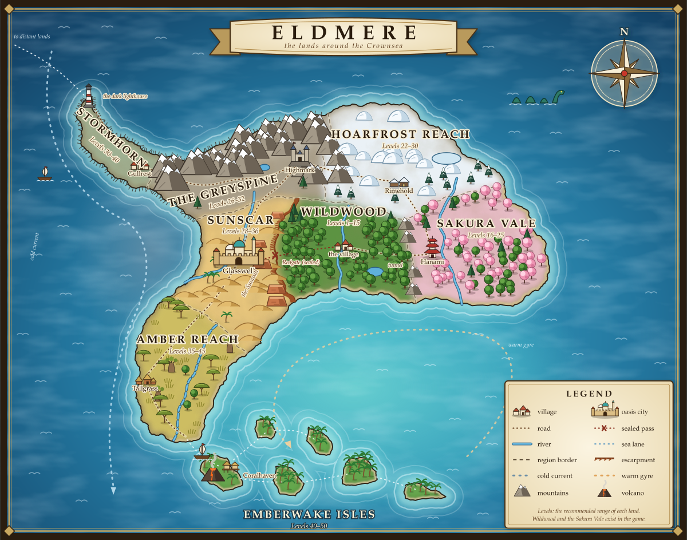

# World building: the continent of Eldmere

Read this before adding a region, a village, a boss, lore, or anything that says where a place is or what lies beyond it.
It turns the owner's hand-drawn draft of the home continent into a geography that makes sense, and sets the rules that keep
future regions consistent. **It is a design document, not a description of the code**: only Wildwood, the Sakura Vale and the Hoarfrost Reach exist in
the game today (and the Greyspine: its ground, Highmark, monsters, two bosses and water, but not the lands behind its gates), and the game's current layout does not have to match this map yet (section 8 says how the two meet).

**Decided by the owner**: the shape of the continent, which region borders which, where the settlements are, the order of the
journey (section 5), every region's level range, the Sunscar's oasis *city*, and a big cave region between Wildwood and the Greyspine
(not on the map). Everything marked *(proposed)* is a suggestion: names, cultures, gates, bosses, lore. Ask before building on it.



`docs/world-map.svg` is drawn by `docs/world-map.py` from the draft's coordinates (2000 x 1574, north up): coast points `M`, region
borders `BRAW`, settlements `TOWNS`, labels `LABELS`, rivers `RIVERS`. Change the data there and run
`python3 docs/world-map.py docs/world-map.svg` rather than editing the SVG by hand. The style (painted climates, terrain icons, roads,
parchment banner and legend) takes its cues from open-world game maps in general, not from any one game.

## 1. The continent at a glance

Eldmere is a crescent of land curled around a warm inland sea, **the Crownsea**. The crescent's west end is a hooked cliff peninsula,
its spine is a snowy mountain range along the north, and a chain of volcanic islands closes the ring in the south. Under the land between
Wildwood and the Greyspine lies a vast cave system, **the Rootdeep**. Other continents exist across **the Outer Deep** (the open ocean);
they are out of scope for now, but the Stormhorn's lighthouse is where the way to them will begin.

| Draft label | Name *(proposed)* | Levels | Landform | Climate | Settlement *(proposed name)* |
|---|---|---|---|---|---|
| wildwood - starter forest | **Wildwood** | 1-15 (built) | lowland basin, rivers to the Crownsea | mild, rainy (monsoon) | the village |
| hanami - japanese zone | **Sakura Vale** | 16-25 (built) | temperate coastal vale, glacier-fed rivers | mild, four seasons | Hanami |
| snowy zone | **Hoarfrost Reach** | 22-30 (built) | high frozen plateau: tundra, taiga fringe, glaciers | polar | Rimehold |
| mountain zone | **the Greyspine** | 26-32 (built, but for the lands behind its gates) | young alpine range, snow above the snowline, fjords | alpine | Highmark |
| desert | **Sunscar** | 28-36 | raised plateau desert behind an escarpment, one river | hot and dry, cold nights | **Glasswell, an oasis city** |
| narrow cliff shore | **Stormhorn** | 30-40 | narrow hooked peninsula of sea cliffs and stacks | cold, foggy, gales | Gullrest |
| (not on the map) | **the Rootdeep** | 30-47 | caves under Wildwood's northern foothills and the Greyspine | underground | none (camps) |
| savana | **Amber Reach** | 35-45 | rolling grassland, scattered trees, seasonal rivers | wet and dry seasons | Tallgrass |
| tropical islands | **Emberwake Isles** | 40-50 | volcanic island arc, reefs, lagoons | hot, humid, storms | Coralhaven |

Waters: **the Crownsea** (warm, sheltered, turquoise shallows), **the Greywater Bight** (the cold bay between Stormhorn and Amber
Reach), **the Outer Deep** (everything beyond).

The level ranges overlap on purpose: when you outgrow one land, two or three others already suit you, so the world opens up instead of
being a single corridor (section 5). The top level becomes 50.

## 2. Why the land looks the way it does (the geography logic)

These are the physical reasons behind the draft. Use them to answer "what would be here?" questions; don't contradict them without the
owner's yes.

1. **Latitude runs north (cold) to south (hot).** Eldmere lies in the northern half of its world: the snow is in the north (Hoarfrost,
   Greyspine peaks), the tropics in the south (the isles). The savanna sits between the desert and the tropics because rain grows southward.
2. **The Greyspine is the backbone.** A young, high range along the north coast, from the Stormhorn in the west to the Hoarfrost plateau
   in the east. A lower spur runs south from it between Wildwood and the Sakura Vale: **the Vale Wall** (the game's border), which ends in a waterfall (**the Greyfall**, off the Greyspine's high rim above Wildwood's north-east): below it the Wall is **the Greyfall River**, a wide meandering river to the Crownsea, crossed by one stone bridge (its gate is the one the Rootwarden opens; there is no mountain spur any more). Snow stays on every peak above the snowline; the snowline is lower the farther north you are.
3. **The Hoarfrost Reach is a plateau, not a range.** Where the Greyspine meets the north-east it widens into a high, flat, ice-covered
   tableland with rounded domes and slow glaciers. Its glaciers melt south into the Sakura Vale: that is why the Vale's rivers and
   waterfalls (Jade Falls) are cold, clear and full all year.
4. **The Stormhorn is the drowned tail of the Greyspine.** The range sinks westward into the sea; only its ridge still stands above water,
   which is why the peninsula is narrow, high, cliff-edged and hooked. The Greyspine's south-west coast is a fjord coast for the same reason.
5. **A cold current hugs the west coast.** It comes down from the far north past the Stormhorn, fills the Greywater Bight and runs south
   past Amber Reach. Cold water makes cold, foggy, rainless air: the Stormhorn is misty and the Sunscar's coast is a *fog desert* (like real
   deserts on the west coasts of continents).
6. **The Crownsea is warm and brings the monsoon.** Sheltered by land on three sides and by the isles on the fourth, it heats up; its
   warm gyre turns clockwise and its summer winds blow north onto Wildwood and the Sakura Vale. That is why they are green and lush.
7. **The Sunscar is dry for two reasons at once.** The Sunwall, a long escarpment (cliff line) on its east side, lifts the land from
   Wildwood's lowland to a high plateau: monsoon air rains on Wildwood and arrives over the plateau dry. On the west, the cold current
   gives no rain either. A single river from the Greyspine's snowmelt crosses the desert to the Bight, and it is the only reason a city
   can stand there (Glasswell).
8. **Amber Reach is a gradient.** Its north edge is thorn scrub like the desert; farther south the rains of the Crownsea's monsoon reach
   it for part of the year, so it is grass with scattered flat-topped trees, and its rivers run only in the wet season.
9. **The Emberwake Isles are volcanoes in a line.** The western island is the youngest (high, an active volcano, black sand, the town),
   the others are older and lower going east, and the easternmost is a worn sand bar with palms. Reefs ring them; the water between them
   is shallow and warm.
10. **The Rootdeep is where water ate the rock.** The foothills between Wildwood and the Greyspine are limestone: snowmelt sinking through
    it for ages carved caves, sinkholes and underground rivers (real karst). Deeper down are older lava tubes from the time the Crownsea was
    a volcano (section 7), and on top Highmark's miners have dug into both. The underground river comes out as the springs of Wildwood's river.
11. **Rivers**: every river starts at snow, a spring or a lake, flows downhill, joins but never splits (except in a delta), and ends in the
    sea or a salt lake. Wildwood's river rises from the Rootdeep's springs and runs to the Crownsea; the Vale's from the Hoarfrost glaciers
    to the Crownsea; the Sunscar's from the Greyspine to the Bight; Amber Reach's is seasonal and ends in a southern delta.

### How the borders should feel (no hard lines)

Neighbouring regions blend over a transition band (in the game about 50-100 m) where both regions' plants and colours mix:

| Border | Transition |
|---|---|
| Wildwood → Sunscar | oak forest thins to dry pine and scrub, then the red cliffs of the Sunwall; **Redgate Canyon** is the one break in it |
| Wildwood → Greyspine / Hoarfrost | foothills with sinkholes and cave mouths (the Rootdeep), then conifers, bare rock and snow |
| Wildwood → Sakura Vale | the Vale Wall (the Greyfall bridge); maples and first cherry trees on the east side |
| Sakura Vale → Hoarfrost | cedar highlands with hot springs (volcanic heat under the ice), then a glacier tongue |
| Greyspine → Hoarfrost | a wide glacier-carved valley; peaks give way to flat white domes |
| Greyspine → Stormhorn | the range narrows to a single windswept ridge (a natural pass at the neck) |
| Greyspine → Sunscar | alluvial fans and red badlands at the mountains' feet, where the river leaves the range |
| Sunscar → Amber Reach | dunes → gravel plain → thorn scrub → grass; a dry riverbed marks the line |
| Amber Reach → Emberwake Isles | the sea: reached by boat from the southern cape |

## 3. The regions

Each entry is what an agent needs to build it: look, life, monsters, elements, weather, the settlement and boss ideas. Monster ideas
follow the existing rule (section 6): the five home families come back reshaped by the land, plus creatures of the place.

### Wildwood (built, levels 1-15)
Temperate broadleaf basin, the heart of the continent and the start. The Rootwarden guards its Stone Circle. Keep it as the game has it.
Elements: earth, water, some fire (Ember Flats). Future lore: the Heartwood is the oldest living thing on Eldmere, and its roots reach
down into the Rootdeep.

### Sakura Vale (built, levels 16-25)
Temperate vale with cherry, maple, bamboo and cedar; Japanese folklore (kodama, kitsune, oni, tengu). Hanami village and the soul shrine.
Bosses: Akaoni at the Demon Gate (20), Kyuubi at the Foxfire Shrine (25). Its rivers come from the Hoarfrost glaciers. Add later if
wanted: hot springs (onsen) near the northern border, where the land starts to climb.

### Hoarfrost Reach (built, levels 22-30)
**Built** (section 8 has the numbers): Frostgate Pass and its ice wall, Rimehold, nine zones, two bosses, snow instead of rain, the Wayfarers' Lodge. What follows is the design it was built from; where the game chose differently the line says so.

- **Look**: white plateau, blue glacier ice, frozen lakes, dwarf birch and a taiga fringe of dark spruce on its southern edge, aurora at night.
- **Culture** *(proposed)*: Nordic-inspired: longhouses of timber and turf, rune stones. Rimehold is a walled town of hunters and ice-fishers.
- **Monsters**: Frost Slime, Snow Boar, Ice Beetle, Frost Goblin (reaver), Frozen Treant; local: ice wolves, yeti, wendigo-like wraiths, frost wyrm.
- **Elements**: water (ice), air, dark (the polar night).
- **Weather**: snowfall, blizzards (short sight range), clear cold nights.
- **Boss ideas**: a mid boss in an ice cave (~26); the final boss (30), a frost giant or a wyrm frozen in a glacier. **Built**: **Ymrik, the Rimeking** (a frost giant, level 26, in his ice hall) and **Vetrmaw, the frost wyrm** (level 30, nesting beside the wreck of the iron bird, `STORY.md`).
- **The wonder** (rule 9 of section 6): the plateau's wonder is the iron bird, a wreck the hunters call a dragon's skeleton; the lore explains it (`STORY.md`).

### The Greyspine (levels 26-32)
**Built so far: the terrain only** (section 8 has the numbers; `docs/NOT-BUILT.md` section 3b lists the rest). The design below is what it is built toward.

- **Look**: alpine meadows, pine and larch, scree, waterfalls, snowfields above the snowline, fjords with cold dark water on the south-west.
- **Culture** *(proposed)*: an alpine mining and monastery town (Highmark) built into the rock near the Hoarfrost border; rope bridges,
  shrines on passes. Its deepest mine broke into the Rootdeep.
- **Monsters**: Stone Slime, Ram-horned Boar, Crystal Beetle, Mountain Goblin (miner), Stone Treant; local: harpies, gryphons, rock golems, trolls.
- **Elements**: earth, air.
- **Weather**: sudden mist, thunderstorms on peaks, avalanches as a boss mechanic.
- **Boss ideas**: a gryphon queen on a peak (29); a mountain golem woken by the miners (32). A short range: it is mostly a crossroads.

### Sunscar (levels 28-36)
- **Look**: a high plateau of dunes, red mesas, salt pans, fields of black glass sand; the green ribbon of the river with palms and
  fields; a fog coast on the Bight.
- **Glasswell, the oasis city**: the only city on the continent (every other settlement is a village). It stands on both banks of the
  river where it widens into an oasis lake, fed by a deep spring (the great well that names it). Walls with gate towers, domes and
  minarets, a covered bazaar, palm gardens and irrigated fields around it, a harbour of river boats, caravan grounds outside the gate.
  It is rich because every caravan between the north (Greyspine) and the south (Amber Reach) stops at its water. In the game it should be
  bigger than a village: districts (bazaar, palace or temple, harbour), more NPCs and shops, perhaps a place for the guild, trading
  between players or an arena later.
- **Culture** *(proposed)*: desert-trading culture inspired by the Middle East and North Africa: mud-brick and stone, domes, courtyards,
  caravans; sandstone ruins of an older people in the dunes.
- **Monsters**: Sand Slime, Scarab Beetle, Tusked Warthog, Desert Goblin (raider), Cactus Treant; local: scorpions, sand worms, mummies, djinn.
- **Elements**: fire, earth, light.
- **Weather**: no rain; sandstorms instead; hot days, cold nights; morning fog on the coast.
- **Boss ideas**: a guardian of the glass fields (32); a sand wyrm under the dunes (36), whose defeat reopens **Redgate Canyon**, a shortcut home to Wildwood.

### Stormhorn (levels 30-40)
- **Look**: a narrow ridge of grass and heather over sheer sea cliffs, sea stacks, sea caves, shipwrecks, a tall dark lighthouse at the tip.
- **Culture** *(proposed)*: Celtic-inspired fisher and wrecker village (Gullrest) at the neck: stone cottages, cairns, standing stones.
- **Monsters**: Brine Slime, Crab-shelled Beetle, Sea Boar (walrus-like), Wrecker Goblin, Driftwood Treant; local: sirens, selkies, sea serpents, drowned sailors.
- **Elements**: air, water, light (the lighthouse).
- **Weather**: gales, sea fog, heavy rain. Walking along the narrow horn with wind and fog is the region's identity.
- **Layout**: the levels climb along the horn, 30 at the neck to 40 at the tip. A side branch: a dead end you go down and come back from.
- **Boss ideas**: drowned captain in the sea caves (35); a kraken at the tip, fought on the lighthouse rocks (40). The lighthouse stays dark
  until the end of the whole journey (section 7).

### The Rootdeep (levels 30-47, underground, not on the map)
A great cave system under the land between Wildwood and the Greyspine, the biggest level range of any region. It goes down in three
layers, each deeper, hotter and stranger:

| Layer *(proposed names)* | Levels | What it is |
|---|---|---|
| **The Rootways** | 30-35 | root-laced tunnels right under Wildwood's foothills: the Heartwood's roots, glow-worms, giant mushrooms, the underground river |
| **The Glimmer Halls** | 36-41 | huge caverns, a black underground lake, crystal forests, the ruins of the people who raised the Stone Circle |
| **The Emberdeep** | 42-47 | old lava tubes near the Crown's buried fire: magma light, obsidian, the heat of the world |

- **Entrances**: Highmark's deep mine (Greyspine side, the main one, open once the Greyspine's final boss falls) and a sinkhole in
  Wildwood's northern foothills, sealed at first and opened from inside as a shortcut home (like Redgate).
- **Settlement**: none. Camps instead: a miners' camp at the mine's end, a hermit's shrine by the lake, each with a teleport circle.
- **Monsters**: Glow Slime, Blind Cave Beetle, Tunnel Boar (mole-like), Deep Goblin, Root Treant / Fungal Treant; local: giant bats,
  cave spiders, mushroom folk, crystal golems, a blind wyrm.
- **Elements**: earth and dark in the upper layers, dark and fire in the Emberdeep.
- **Weather**: none: no sky, no day or night. Light comes from glow-worms, crystals, lava and your torch. Dripping water, echoes.
- **Boss ideas**: one per layer (35, 41, 47): the root-bound heart of the Rootways, a lake leviathan, the Emberdeep's fire wyrm.
- **Not on the map** because it lies underneath; don't draw it on `world-map.svg`. If a map of it is needed, make a separate one.

### Amber Reach (levels 35-45)
- **Look**: golden grass, flat-topped trees, giant baobab-like trees, termite mounds, waterholes, a green river delta in the south.
- **Culture** *(proposed)*: herder and trading settlement (Tallgrass) on the west coast, with a pier; another landing on the southern cape for boats to the isles.
- **Monsters**: Mud Slime, Dung Beetle (giant), Great Boar, Hyena Goblin, Baobab Treant; local: lion-folk, thunderbirds, giant elephants or mammoth-like beasts.
- **Elements**: earth, air, fire (grass fires).
- **Weather**: a wet season (storms) and a dry season (heat haze, grass fires).
- **Boss ideas**: a storm bird (40); a great beast of the herds (45), whose defeat opens the boats to the isles.

### Emberwake Isles (levels 40-50)
- **Look**: black-sand beaches, palms, jungle, lava fields and a smoking volcano on the big western island; turquoise lagoons and reefs between the isles.
- **Culture** *(proposed)*: seafaring island people (Coralhaven): stilt houses, outrigger boats, carved totems.
- **Monsters**: Lava Slime, Coral Beetle, Jungle Boar, Reef Goblin (pirate), Palm Treant; local: salamanders, fire lizards, giant turtles, sea dragons.
- **Elements**: fire, water, light.
- **Weather**: warm rain showers, tropical storms, ash falls when the volcano stirs.
- **Travel**: boats and teleport circles between the islands (they are too far to swim). Levels rise island by island, west to east
  or towards the volcano.
- **Boss ideas**: a sea dragon (45); the fire spirit of the volcano (50), the last boss of the continent. See section 7.

## 4. Level ranges at a glance

```
level      1    5    10   15   20   25   30   35   40   45   50
Wildwood   |==============|
Sakura Vale               |=========|
Hoarfrost                        |========|
Greyspine                            |======|
Sunscar                                |========|
Stormhorn                                |==========|
Rootdeep                                 |=================|
Amber Reach                                   |==========|
Emberwake                                          |==========|
```

## 5. The journey

The owner's order: **the journey circles the Crownsea**, from Wildwood east to the Vale (built), then clockwise around the continent,
finishing in the isles that close the ring. The overlapping levels turn the middle of it into a choice of roads:

```
Wildwood 1-15 → Sakura Vale 16-25 → Hoarfrost Reach 22-30 → Greyspine 26-32 ─┬→ Sunscar 28-36 → Amber Reach 35-45 → Emberwake Isles 40-50
                                                                             ├→ Stormhorn 30-40 (a side branch west)
                                                                             └→ the Rootdeep 30-47 (down, alongside everything else)
```

- The Hoarfrost opens during the Vale (level 22), so players reach the snow before finishing the Vale's last boss.
- The Greyspine is a short crossroads: from it the river leads south into the Sunscar, the neck pass west to the Stormhorn, and
  Highmark's mine down into the Rootdeep. A player of 30-36 can pick any of the three.
- The Rootdeep's long range means it is visited in stages: its upper layer alongside the Sunscar and Stormhorn, its deepest layer
  alongside Amber Reach and the isles.
- The Sunscar borders Wildwood but is reached late, from the north, because the Sunwall is a cliff and Redgate Canyon is blocked:
  reopening it is a satisfying shortcut home.

**Gates** *(proposed)* follow the pattern the game already has: a boss opens a road (the Rootwarden opens the bridge gate; saved as `gear.east`).

| Road | Opened by |
|---|---|
| Vale → Hoarfrost (the ice wall in Frostgate Pass, north of Hanami) | Akaoni (20) **(built: `gear.north`)** |
| Hoarfrost → Greyspine (the glacier valley) | Kyuubi (25) or the Hoarfrost's mid boss (26): **Ymrik (26) is chosen; the valley is not built yet** |
| Greyspine → Sunscar (the river road) | the Greyspine's first boss (29) |
| Greyspine → Stormhorn (the neck pass) and → Rootdeep (Highmark's mine) | the Greyspine's final boss (32) |
| Sunscar → Amber Reach (the dry riverbed) and Redgate back to Wildwood | the Sunscar's final boss (36) |
| Amber Reach → Emberwake Isles (the boats) | the Amber Reach's final boss (45) |
| the Stormhorn's lighthouse, and the way to other continents | the isles' final boss (50) |

A gate must be a real thing in the land (rock fall, ice, a closed door, no boat), never an invisible wall.

## 6. Rules for adding a region

1. **Keep the draft's topology.** Who borders whom, the coastlines and the settlement positions are the owner's. The scale is not fixed.
2. **Size**: a region is roughly 450-650 m across in the game (the Vale is 550 m wide, Wildwood 880 m); a wide level range (Stormhorn,
   the Rootdeep) needs more room than a short one (Greyspine). The draft is not to scale: the whole continent at Wildwood's scale would be
   about 3 x 2.2 km, too large to load at once.
3. **The sea is the world's edge.** Where the draft has coast, the game needs a shore (beach, cliffs or mangrove) and water, not mountains.
4. **Levels**: use the region's range from section 1. Two monster kinds per level (the Vale's pattern) is the default; overlapping levels
   can share fewer kinds. A mid boss and a final boss; the Rootdeep has one per layer.
5. **Monsters**: the five home families (slime, beetle, boar, goblin, treant) always return, reshaped by the region, plus 5-10 creatures from the
   region's folklore. The Vale did this (Sakura Slime, Kabuto Beetle, Mountain Boar, Goblin Ashigaru, Bamboo Treant).
6. **Elements**: most monsters in a region use its 2-3 elements (listed above) so the soul and skill choices matter per region.
7. **A settlement per region**, at the draft's square: its own culture, a shop, a forge, a quest board, a teleport circle, a music theme.
   Villages everywhere except the Sunscar's city; camps in the Rootdeep.
8. **Cultures** are *inspired by* real places (as Hanami is by Japan) and treated with respect: a fantasy version, not a caricature.
   Use real folklore creatures correctly or give them a new name.
9. **One wonder per region.** Each region may break real geography once, on purpose, and the lore explains it (the glass fields of the
   Sunscar, a floating rock in the Greyspine). Everything else follows section 2.
10. **Weather and sky belong to the region**: rain in the desert, blizzards in the forest or a tropical sky in the north break the illusion.
    The server's weather is one for the whole world today: regional weather needs a change (ask first).
11. **Borders blend** (section 2): plants, ground colour, fog colour and music cross-fade over the transition band.
12. **Update this file and the map** (`docs/world-map.py`, then regenerate the SVG) when a name, level range or gate is decided or built.
    Mark built regions in the table of section 1.

## 7. Lore and the land

The story and the hidden truth are in **`docs/STORY.md`** (spoilers; the player learns the truth only at the end of the Amber Reach
storyline). What it means for the geography:

- **The Crown.** A vast mountain stood where the Crownsea is now, the source of the six elements. It was broken in a war that Eldmere lost
  and that everyone has forgotten; it erupted and drowned (Eldmere believes the gods did it: "the Sinking"). The Crownsea is its flooded
  caldera, Eldmere the northern half of its rim, the Emberwake Isles the southern rim, still burning.
- **War scars disguised as wonders**: the Sunscar's glass fields (a weapon, "where the sun wept"), the iron bird in a Hoarfrost glacier
  (a wrecked aircraft, "a dragon's skeleton"), steel shipwrecks on the Stormhorn, the Demon Gate's uncuttable stone, the stone and
  teleport circles (Eldmere's own lost craft, "gifts of the gods").
- **Dark energy and monster strength**: the other continents pour their dark energy into the Sink in the Emberwake volcano; it spreads
  through the old lava tubes under the land (the Rootdeep's Emberdeep). Monsters grow stronger the closer a land is to the Sink, which is
  why the levels rise around the ring. Wildwood, over the Heartwood's roots, is touched least.
- **The Rootdeep** holds the Heartwood's dying roots, the ruins of Eldmere's lost age, and the metal pipes of the dumping.
- **Gates** (section 5) are the roads the story opens; the ending relights the Stormhorn's lighthouse, the way to the other continents.

## 8. The current game and this map

- **The two playable lands' edges follow this map** (`shared/terrain.js`: `coastDist`, `shore`, `sunwall`, `bareGround`; colours in
  `game/world/terrain-color.js`; names on the world map in `edgeName`, `game/ui/map.js`):
  - Wildwood: north the Greyspine's snowy foothills; west **the Sunwall**, red cliffs up to a sandy plateau (52 m), with **Redgate
    Canyon** cut through it at z = 40 and choked by a rock fall; south the **Crownsea shore** (a ~20 m beach, the river runs into the sea);
    east the Greyfall River (the Vale Wall, with its one bridge).
  - The Sakura Vale: west the Greyfall River (and the bridge), north the snowy climb towards the Hoarfrost, south and east the Crownsea shore (bays, capes and islets).
  - **The sea is the edge of the Hoarfrost Reach and the Greyspine as well, and the continent is no rectangle**: no mountain wall closes the north or the east. The coast is a drawn outline (`CS_BASE` in `shared/coasts.js`, `docs/areas/regions.md`): an L, with the Reach running out past the vale as a broad cape (one long cape of its own to the east), capes and bays along the Greyspine's north coast (the Gryphon Queen's mountain runs on into the sea as a cape), a step north where the Greyspine meets the Reach, and bays along the vale's east and south shores; islets lie off the bays. Still straight: Wildwood's south shore (the Tide King's beach depends on it) and the west edge (the Sunwall, the Greyspine's west wall).
  - On the shore you can wade in to the knees and no further (`worldBounds` in `game/player/movement.js`).
  - **None of the four lands' borders is a straight line** (`borderX(z)`, `borderZ(x)` in `shared/terrain.js`; `docs/areas/regions.md`): the Vale Wall's river meanders up to 215 m west into Wildwood, the north walls bend 90-110 m, the mountain range between lands has broad massifs and necks, and the gates (the bridge, Frostgate Pass, the glacier valley) and the junction of the four lands are pinned where they were.
  - No edge is a straight line: the shore has bays up to ~28 m deep (the vale's south-east corner is rounded), the Sunwall's cliff
    wanders +-22 m (`sunwallLine`), the northern rims start rising up to 40 m early (`rimWobble`), and the world map fades each land
    out along a wavy line (`mapEdgeAlpha`), so neither land looks like a rectangle.
  - **Monsters by the land they live in**: every part of Wildwood has monsters. The outer ring's zones (12-15) reach on to the edges,
    and each edge has its own zone and creatures, levels 16-20 (optional ground for players back from the vale, not on the main quest's
    path): **the Crownsea Shore** (Shore Crabs 16, Tide Slimes 17, and on its beach west of the river the level-20 boss **Carapax, the Tide King**, a crab as big as a boat: `ARENA_TIDE`, `shared/beach.js`), **the Sunwall's Foot** (Sun Scarabs 18, in the red scree), **the
    Greyspine Foothills** (Ram-horned Boars 19, Crag Wardens 20). The Vale Wall has none. (The Vale's shores still hold the Vale's own
    zones: a coastal kind for them is a possible next step.)
  - **Roads** (`shared/roads.js`): the East Road from the village over **the river bridge** to the Greyfall bridge, with the Circle Path to the
    Stone Circle; the Redgate Road west to the sealed canyon; the Shore Road south to the beach. In the Vale: the Tunnel Road (it kept its name) into
    Hanami, the Gate Road to the Demon Gate, the Shrine Road to the Foxfire Shrine, the Coast Road to the east shore and the North Road
    towards the Hoarfrost. Roads cut through the zone ridges, and trees and monster camps keep off them.
  - **The drowned roads**: where a road dips under still water, a plank causeway on posts carries it across (`BRIDGES` kind
    `causeway`, one per wet stretch, found automatically): the Drowned Road (the Redgate Road, west of the village), the Long Planks
    (the Shore Road's flooded valley), the Heron Steps (a pond on the East Road), and short ones in the vale. The lore (`STORY.md`,
    act I): the ancients' paving runs on under the water.
  - **The story's places** (`shared/main-quest.js`): Wren's sickbed by the village gate, Odran's cart outside each village's gate,
    heartleaf in the Slime Meadow, and readable spots (`LORE`: the Stone Circle's carvings, old letters by the bridge, the drowned roads'
    signs and milestone, a grey wreck on the shore, the Demon Gate's stone, a roadside shrine, **the ice wall** closing the North Road).
    Trees and bushes keep clear of them (`storyClear`).
  - The lake in the west forest is **Mistmere** (the Greywater name belongs to the Bight).
- **The Hoarfrost Reach** (what it leaves out is commented in `docs/NOT-BUILT.md`) (`shared/hoarfrost.js`, heights in `shared/terrain.js`, dressing in `game/village/buildings-hoar.js`):
  - The world rectangle grew twice (`NORTH_D` = 800, `EAST_W` = 830, `HZ0` = the vale's and forest's old north edge at z = -440, `WZ0` = -1240, `WX1` = 1270): 1710 x 1680 m. The first growth (600 m north) made room for the Reach and the Greyspine;
    the second made the **Reach a landmass as big as the others** (244,000 m2 of land became about 495,000: the vale has 515,000, Wildwood 586,000, the Greyspine 642,000) by running its plateau on east and north past the vale's and the Greyspine's
    own edges (`VALE_E` = HALF + 550 and `GREY_N` = HZ0 - 600 stay where they were; the rectangle east of the vale and north of the Greyspine is sea). The new snow land has no camps, nodes or villages yet (`docs/NOT-BUILT.md` 3c). The
    part north of the home forest is the Greyspine (`greyspineHeight` in `shared/greyspine.js`; section 8 below).
  - **Shape**: the vale's north rim goes on as a crest (~80-90 m) along z = HZ0 and eases down over ~60 m onto the plateau (~50 m up, rolling white
    domes, `hoarHeight`), with the Vale Wall in the west and the sea in the north and the east (a coast of bluffs, long beaches in the bays and islets: `shared/coasts.js`). Three **frozen lakes**
    (`FROST_LAKES`: Frostmere, Mirrorice, Blue Tarn) are flat, walkable ice, not water.
  - **Frostgate Pass** (`PASS`, at x = 636): a canyon carved through the crest, its floor climbing from the vale (3 m) to the plateau (58 m) over 185 m
    between walls 30-40 m above it. **The ice wall** stands across it at `PASS.ice` until Akaoni falls (`gear.north` 1; stopped by
    `frostWall` in `player/movement.js` and by `setPos` on the server; it sinks with a rumble when the wall opens). Walking into Rimehold sets
    `gear.north` 2 (its teleport circle wakes).
  - **Rimehold** (`VIL3`, the third village, at (690, -610), 30 m radius, entrance turned to the pass): Nordic timber houses with turf roofs under snow, iron braziers, a
    great fire, a gate with shields and rune stones, the Wayfarers' Lodge yard. The same jobs as the other villages plus the Lodge.
  - **Zones** (9 Voronoi cells like the vale's, keys `h22`..`h30`, route: 22 Rimewood Edge, 23 Whitebirch Flats, 24 Frostmere Shore, 25 Hunters' Wold,
    26 the Rimeking's Hall, 27 Glacier Tongue, 28 Blizzard Steppe, 29 Bonefrost Barrow, 30 the Wyrm's Glacier), two monster kinds each, 12 of every
    kind (216 monsters): frost slime, snow boar, ice beetle, winter wolf, frost reaver, rime wisp, rimebark treant, yeti, draugr, ice wraith,
    snow lynx, glacier crawler, frost troll, blizzard hound, rime revenant, barrow wight, frostfang alpha, glacier golem (elements water, air, dark).
    Two boss arenas: the Rimeking's Hall (an ice-pillar ring and a great ice arch) and the Wyrm's Nest (the iron bird's wreck, ice mounds, warm air).
  - **Roads**: the North Road runs on to the ice wall, the Frost Road through the pass to Rimehold, the Hall Road and the Wyrm Road to the two halls.
  - **Weather**: the server still has one weather for everyone; the client turns rain into snowfall and a storm into a blizzard whenever the camera is in the
    Reach (`WX.snow`, `game/world/weather.js`; a lower, whiter sky, wind instead of patter, `audio/rain.js`). The plateau is white: snow, blue ice, tundra
    patches, dark needles under the spruce of the southern fringe (`hoarColor`); the aurora on clear nights (`game/world/aurora.js`); frosted spruce, dwarf birch, snow-capped boulders; no petals, birds, crickets
    or frogs; wolf howls at night; a soft crunch underfoot.
  - **Travel**: the teleport circle in each village opens a window to choose where to go (`CIRCLES`, `ui/travel.js`, `warp{to}`).
  - **Cost**: the heightmap grew from 716 x 441 to 716 x 741 cells (client, full detail), the terrain is drawn in 64 x 128-cell tiles culled by distance
    in both directions, the placeholder far-lands grid keeps its old origin.
- **The Greyspine** (`shared/greyspine.js`, `highmark.js`, `greyzones.js`; the terrain first, then the rest below; heights, walls and the two places below are shared code, colours are `greyColor` in `game/world/terrain-color.js`):
  - **Where**: the part of the world rectangle north of the home forest and west of the Reach, x -440..440 and z -1040..-440 (880 x 600 m, `inGrey(x,z)`). It fits inside the
    rectangle that grew north for the Reach, so nothing had to grow. Ground 31 m (the troughs, west) to about 230 m (peaks); the walls reach about 300 m.
  - **Shape** (a young, glacier-carved range): a long trough, **the Long Valley** (`GREY_VALLEYS[0]`: floor 34 m in the west to about 76 m in the east, 48 m wide and flat, flanks that
    are foothills), wandering west to east between where the Reach's glacier valley will come in and where the river road to the Sunscar will leave; four side valleys that climb into
    cirques (`up` metres to their heads): **the North Fork** (to the spine's snowfields), **the Queen's Fork** (under the Gryphon Queen's peak), **the Neck** (west, towards the
    Stormhorn) and **the Sink Valley** (south, towards the rim where the Rootdeep's sinkholes will be). Between the troughs: ridged mountains whose height grows with the distance
    from a trough and towards the north, so the spine along the north edge is the highest ground. A domain warp of +-38 m keeps the troughs from looking ruled.
  - **Walls**: south, the home forest's rim goes on as its crest at z = HZ0 and eases down over ~66 m (`baseHeight`); east, the Reach's west wall seen from the other side (the ground
    is blended into `hoarBase` and the same crest terms are added, so at x = HALF - 6 it differs from `hoarHeight` by 0.2 m on average and the lands meet without a step); west, a crest of its own (`rw`); north, no wall: the spine lowers and comes down to the northern sea (`shore` with a long run, `shared/coasts.js`; the Queen's cone stays a headland). A player can climb to 14 m short of a crest while the land beyond is locked (`greyWall`, `frostWall`), never over. The walls are
    broken in three places, each by a canyon with a shut gate (below).
  - **Two places are shaped for what comes next**: **Highmark's shelf** `GREY_HM` (292, -792 after the way in was cut): a flat bench 26 m above the trough at the North Fork's mouth, radius 34 m (the village
    goes here); **the Gryphon Queen's peak** `GREY_QUEEN` (-200, -960): a mountain of about 48 degrees with ribs and a flat crown of radius 28 m at 232 m (her arena).
  - **Ground and plants**: alpine meadow (yellow-dry only on the low ground), a darker needle floor under dense woods, grey scree from ~72 m, rock where steep, snow above ~128-142 m
    (lower in the far north, never on steep rock), a red-badlands tint in the south-west where the river will leave the range (WORLD section 2: alluvial fans, red badlands), packed
    earth on the shelf, the Reach's snow drifting over the east crest. The home forest's tree rules apply (pines and spruces, by height) up to the treeline (`greyTreeline`, 92-120 m);
    above it no tree, bush, fern, flower or grass tuft. The zone label says "The Greyspine" on the spine and the zone's name in a zone.
  - **What was built on it** (`docs/NOT-BUILT.md` section 3b lists what was not): **the glacier valley** `GLEN` (z -722; `glenCarve` cuts the Vale Wall at the same z from both sides, 11 m
    half-width at the crest, the floor falling gently to the Reach's plateau) with an **ice fall** at `GLEN.ice` that opens when Ymrik falls (`gear.west`); **Highmark** (`VIL4`) on its shelf, stone
    and slate houses under snow, a Lodge, nine named people, a circle; **seven zones** (26 Highmark Pastures, 27 The Ledgeway, 28 Miners' Scree, 29 Gryphon Cirque, 30 Stone Meadow, 31 The
    Windswept Neck, 32 The Sink; `greyZoneAt`, cut from circle cells like the vale's) with two kinds of monster each (earth and air only) and two boss zones; the **Gryphon Queen** (29) on her
    crown and the **Mountain Golem** (32) in a cavern (`ARENA29`, `ARENA32`); **water**: three tarns, a river that runs west out of the Long Valley, a fjord on the south-west coast; and
    **the two gates** of this document's section 5: the river road (z -586, opened by the Queen) and the neck pass (z -776, opened by the Golem), canyons cut through the west wall (`westCarve`,
    `GREY_GATES`) that end at the world's edge: the Sunscar and the Stormhorn are not built, so nothing lies behind them.
  - **To see it**: Testing tools, "Go to the Greyspine (Highmark's shelf)", "Gryphon Queen's peak", the glen, the cavern and the two rock falls (`dev` `tunnel` `grey` / `queen` / `glen` / `cavern` / `riverfall` / `neckfall`), or `data-v="x,z,degrees"` on `tPass`.
    Test: `node tools/greyspine-smoke.js`. To draw its shape offline: sample `rawHeight` with `loadShared(['rawHeight'])` into a hillshade (slopes: 35% under 0.3, 26% above 0.95).
- **The rest of Eldmere is a low-poly placeholder** (`game/world/far-lands.js`): one flat-shaded mesh around the playable rectangle,
  shaped from this map (the Greyspine's peaks, the Hoarfrost plateau, the Sunscar plateau with mesas, Amber Reach, the Stormhorn, and the
  Emberwake Isles with a smoking volcano), plus one sea to the horizon. It can't be walked on. Its high ground shows faintly through the
  distance haze. When a land is built, it replaces its part of the placeholder.
- The game's world is one rectangular heightmap (`WX0..WX1` x `WZ0..WZ1`, section 9 of `CLAUDE.md`). The rectangle has already grown north (the Hoarfrost
  Reach); the Greyspine now lies inside it (north-west of Wildwood), the Sunscar (west) and Amber Reach (south-west) need it to
  grow in those directions; the isles need water around them and boat or teleport travel.
- **The Rootdeep cannot be made from the heightmap** (a heightmap has no ceilings or overhangs). It needs its own kind of space: enclosed
  cave meshes, reached through a portal at its entrances like a separate instance, with its own lighting (no sun, no sky, no weather).
  The dungeons' plan (`docs/DUNGEONS.md` section 7: runs in far-away slots, a floor-and-wall `getH`, a client scene switch) builds exactly this machinery; the Rootdeep is meant to be its second user.
- Levels past 25: the Hoarfrost Reach's 26-30 work today because `expToNext` is flattened from level 25 on (a level costs as many same-level kills as
  25 -> 26 does) and gear stays at tier 5 (`tierFor`, `MAX_ZONE_LV` 32); levels up to 50 need the curve tuned and more gear tiers
  (`shared/balance.js`, `shared/items.js`), and `CLAUDE.md` section 10 notes that the curve past 15 needs tuning.
